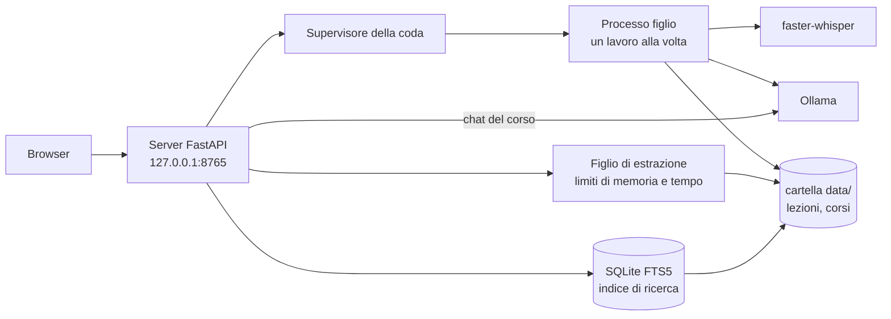

[English](./README.md) | **Italiano**

# Transcriber (sbobina)

Uno strumento per trascrivere in locale le lezioni registrate in italiano: audio e testo non escono mai dal tuo computer.


[](https://github.com/AndreaBonn/speech-to-text/actions/workflows/ci.yml)

Registri la lezione col telefono, trascini il file in una pagina del browser e ottieni il testo diviso in paragrafi con l'orario. Le parole di cui il modello non è sicuro sono evidenziate, così sai quali passaggi riascoltare.

Sotto c'è [faster-whisper](https://github.com/SYSTRAN/faster-whisper) (Whisper large-v3 su scheda NVIDIA, large-v3-turbo sul processore). Un secondo passaggio facoltativo manda il testo a un LLM locale tramite [Ollama](https://ollama.com) per correggere le parole sentite male; l'LLM può solo sostituire brevi gruppi di parole, e ogni modifica finisce in un report delle correzioni. Interfaccia web e riga di comando usano la stessa pipeline.

Le lezioni sono raggruppate per corso. Ogni corso ha una pagina in cui aggiungi il materiale (libro, slide, appunti in PDF, DOCX, PPTX, TXT o Markdown), cerchi insieme nelle lezioni e nel materiale, generi esercitazioni e riassunti e fai domande sul corso. Tutto ciò che scrive l'LLM locale riporta la frase della lezione o la pagina del documento da cui è preso, e le voci con una citazione che non si trova nel materiale vengono scartate.

**Non sei un utente tecnico?** Leggi la [guida utente](./docs/guida-utente.md): spiega passo per passo installazione e uso su Windows, macOS e Linux.

## In pratica

Avvio dell'interfaccia web su Linux con una RTX 4060 (`./avvia.sh`, che esegue `uv run sbobina web`):

```text
INFO Sistema linux: trascrivo con GPU NVIDIA (float16), modello large-v3. Motivo: GPU NVIDIA e librerie CUDA disponibili su linux.
INFO Modello large-v3 già scaricato.
INFO Ollama è pronto.
INFO Interfaccia su http://127.0.0.1:8765
```

Poi il browser si apre sulla pagina di caricamento.

Tempi misurati sull'hardware del progetto (trascrizione e correzione da `src/sbobina/model_catalog.py`, funzioni dei corsi da `specs/001-course-workspace/eval*.md`):

| Passaggio | Hardware | Tempo |
| --- | --- | --- |
| Trascrizione, lezione di 85 min, large-v3 | NVIDIA RTX 4060 8 GB | circa 6,5 min |
| Trascrizione, lezione di 90 min, large-v3-turbo | Intel Core i7 di 13ª generazione (solo processore) | circa 30 min |
| Correzione LLM, lezione di 85 min, qwen3.5:9b | NVIDIA RTX 4060 8 GB | circa 18 min |
| Esercitazione (10 domande) o riassunto, qwen3.5:9b | NVIDIA RTX 4060 8 GB | da 33 a 84 s |
| Domanda sul corso, qwen3.5:9b, modello già caricato | NVIDIA RTX 4060 8 GB | mediana 10 s, massimo 17 s |
| OCR di una pagina scansionata, qwen2.5vl:7b | stessa macchina; il modello non sta in 8 GB e gira sul processore | da 4 a 5 min |

## Funzionalità

- Interfaccia web su `127.0.0.1`: caricamento, coda dei lavori con avanzamento in tempo reale, storico, download dei modelli, tema chiaro e scuro
- Lettore: clic su una parola per far ripartire l'audio da lì; parole incerte evidenziate; elenco dei passaggi da riascoltare
- Correzione a mano nel lettore: selezioni una parola o una frase, scrivi la correzione, salvi
- Esportazione in Markdown, JSON, DOCX e testo semplice (la copia DOCX/TXT non ha orari né segni di revisione)
- Correzione facoltativa con Ollama, limitata a sostituzioni, con report delle correzioni
- Corsi: lezioni raggruppate in base alla **Materia** scritta al caricamento, modificabile poi dal lettore
- Materiale del corso: caricamento di file PDF, DOCX, PPTX, TXT e Markdown; il tipo di file si controlla dal contenuto, non dal nome; i PDF scansionati si possono leggere con un modello visivo locale (OCR), un documento alla volta
- Ricerca testuale in tutte le lezioni e i documenti, filtrabile per corso; un risultato in una lezione apre il lettore a quel secondo
- Esercitazioni (crocette, domande aperte, orale) e riassunti generati dal corso, con citazioni, scaricabili in Markdown e DOCX (compito e soluzioni in file separati)
- Domande sul corso: chat in cui ogni frase della risposta cita un passaggio del materiale; se il materiale non copre la domanda, la risposta lo dice
- Materiali di studio per lezione: riassunto, concetti chiave e possibili domande d'esame, ciascuno collegato al momento della lezione da cui viene
- Confronto Word Error Rate (WER) con una trascrizione di riferimento fatta a mano
- Scelta automatica del dispositivo: CUDA se ci sono una scheda NVIDIA e le sue librerie, altrimenti processore

## Stack tecnologico

| Area | Componenti |
| --- | --- |
| Riconoscimento vocale | faster-whisper 1.2 (CTranslate2), librerie CUDA 12 da wheel pip (extra `cuda`) |
| LLM locale | client Ollama; `qwen3.5:9b` per correzione, materiali di studio, esercitazioni, riassunti e chat; `qwen2.5vl:7b` per l'OCR |
| Documenti | pypdfium2 (testo dei PDF e rendering delle pagine), python-docx, python-pptx, Pillow |
| Ricerca | indice SQLite FTS5 con ordinamento BM25, ricostruito dai file su disco |
| Web | FastAPI, Uvicorn, template Jinja2, JavaScript senza framework, Server-Sent Events per l'avanzamento |
| Esportazione e metriche | python-docx, jiwer |
| Configurazione | pydantic-settings (variabili `SBOBINA_*` o file `.env`) |
| Strumenti | uv, pytest, ruff, mypy (strict), GitHub Actions |

## Architettura



Trascrizioni, materiali di studio, esercitazioni, riassunti e OCR condividono una sola coda e girano uno alla volta in un processo figlio, così un crash o un annullamento non fermano il server web. Al riavvio, i lavori rimasti in corso vengono segnati come interrotti. L'estrazione del testo dai documenti caricati gira in un altro processo figlio con un tempo massimo e, fuori da Windows, un limite di memoria. La chat del corso gira nel processo web; un lock lettori-scrittore impedisce che lei e la fase di trascrizione usino la GPU nello stesso momento. Tutto lo stato sta in file normali sotto `data/`; l'indice di ricerca si può cancellare e viene ricostruito alla ricerca successiva.

## Prerequisiti

- [uv](https://docs.astral.sh/uv/). Gli script di avvio propongono di installarlo se manca; uv poi installa da solo Python 3.12.
- Facoltativo: una scheda NVIDIA con driver funzionante (Linux o Windows). Senza, la trascrizione usa il processore.
- Facoltativo: [Ollama](https://ollama.com/download), che serve per correzione, materiali di studio, esercitazioni, riassunti, domande sul corso e OCR. Trascrizione, lettore, ricerca ed esportazione funzionano anche senza. I modelli Ollama si scaricano dalla pagina **Modelli**; correzione, esercitazioni, riassunti e OCR scaricano il proprio anche al primo uso.
- Circa 8 GB liberi su disco per ambiente e modello Whisper, più lo spazio di ogni modello Ollama che usi (circa 6 GB per `qwen3.5:9b`).

Sviluppo e test avvengono su Linux. I percorsi per Windows e macOS sono implementati ma non ancora provati su macchine reali; [docs/checklist-windows-macos.md](./docs/checklist-windows-macos.md) è la lista di controllo per la prima prova.

## Installazione

1. Clona il repository:

   ```bash
   git clone https://github.com/AndreaBonn/speech-to-text.git
   cd speech-to-text
   ```

2. Avvialo. Su Linux e macOS:

   ```bash
   ./avvia.sh
   ```

   Su Windows, doppio clic su `avvia.bat`.

Lo script installa uv se serve (dopo averlo chiesto), aggiunge l'extra `cuda` quando `nvidia-smi` trova una scheda, prepara l'ambiente e apre `http://127.0.0.1:8765`. La prima trascrizione scarica il modello Whisper (circa 3 GB per large-v3, 1,6 GB per large-v3-turbo), a meno che tu non lo scarichi prima dalla pagina **Modelli**.

Preparazione manuale, senza gli script:

```bash
uv sync                  # solo processore
uv sync --extra cuda     # con scheda NVIDIA
uv run sbobina web
```

`./avvia.sh` accetta `--port N` e `--no-browser`, che passa a `sbobina web`.

## Configurazione

Ogni parametro ha un valore predefinito. Per cambiarne uno, copia `.env.example` in `.env` e modificalo, oppure imposta la variabile d'ambiente. Variabili principali (elenco completo in `src/sbobina/settings.py`):

| Nome | Obbligatoria | Descrizione |
| --- | --- | --- |
| `SBOBINA_WHISPER_MODEL` | ⚠️ | Modello Whisper; `auto` (default) sceglie il modello GPU o CPU qui sotto |
| `SBOBINA_WHISPER_MODEL_GPU` | ⚠️ | Modello usato con CUDA, default `large-v3` |
| `SBOBINA_WHISPER_MODEL_CPU` | ⚠️ | Modello usato sul processore, default `large-v3-turbo` |
| `SBOBINA_DEVICE` | ⚠️ | `auto`, `cuda` o `cpu` |
| `SBOBINA_COMPUTE_TYPE` | ⚠️ | Quantizzazione CTranslate2, `auto` di default |
| `SBOBINA_CPU_THREADS` | ⚠️ | Thread del processore, `0` = uno per core fisico |
| `SBOBINA_LANGUAGE` | ⚠️ | Lingua dell'audio, default `it` |
| `SBOBINA_BEAM_SIZE` | ⚠️ | Ampiezza della beam search, default `5` |
| `SBOBINA_VAD_FILTER` | ⚠️ | Silero VAD, `false` di default (sulle registrazioni lunghe da telefono perdeva parole) |
| `SBOBINA_CONDITION_ON_PREVIOUS_TEXT` | ⚠️ | `false` di default, per evitare ripetizioni in loop su audio di un'ora |
| `SBOBINA_UNCERTAIN_THRESHOLD` | ⚠️ | Le parole sotto questa confidenza vengono segnate, default `0.7` |
| `SBOBINA_OLLAMA_MODEL` | ⚠️ | Modello testuale per correzione, materiali di studio, esercitazioni, riassunti e chat, default `qwen3.5:9b` |
| `SBOBINA_OLLAMA_HOST` | ⚠️ | Default `http://localhost:11434` |
| `SBOBINA_OCR_MODEL` | ⚠️ | Modello visivo per i PDF scansionati, default `qwen2.5vl:7b` |
| `SBOBINA_OCR_SCALE` | ⚠️ | Scala di rendering delle pagine per l'OCR, default `1.0` (a `2.0` una pagina richiedeva oltre 10 min sul processore) |
| `SBOBINA_CHAT_TIMEOUT_S` | ⚠️ | Attesa massima per una risposta della chat, default `120` |
| `SBOBINA_WEB_PORT` | ⚠️ | Default `8765` |
| `SBOBINA_DATA_DIR` | ⚠️ | Dove vengono salvati lezioni e corsi, default `data` |
| `SBOBINA_WEB_MAX_UPLOAD_MB` | ⚠️ | Limite di caricamento dell'audio, default `1024` |
| `SBOBINA_COURSE_DOC_MAX_MB` | ⚠️ | Limite di caricamento dei documenti del corso, default `200` |

`SBOBINA_WEB_HOST` accetta solo `127.0.0.1`, `::1` o `localhost`: il server non può essere esposto in rete.

## Riga di comando

La pipeline di trascrizione funziona senza interfaccia web. Le funzioni dei corsi (materiale, ricerca, esercitazioni, chat, OCR) sono disponibili solo nell'interfaccia web.

| Comando | Cosa fa |
| --- | --- |
| `uv run sbobina trascrivi lezione.m4a -o sbobine/` | Trascrive; scrive `lezione.json` e `lezione.md` |
| `uv run sbobina rendi sbobine/lezione.json --soglia 0.8` | Rigenera il `.md` con un'altra soglia di incertezza, senza ritrascrivere |
| `uv run sbobina correggi sbobine/lezione.json --materia "diritto privato"` | Correzione con Ollama; scrive i file corretti e un report |
| `uv run sbobina studio sbobine/lezione.json` | Materiali di studio con citazioni; scrive `lezione.studio.json` e `lezione.studio.md` |
| `uv run sbobina wer riferimento.txt sbobine/lezione.json` | Word Error Rate rispetto a una trascrizione di riferimento |
| `uv run sbobina web [--port N] [--no-browser]` | Avvia l'interfaccia web |

Nel testo di riferimento per `wer` scrivi i numeri in cifre ("10 minuti"), come fa il modello, altrimenti vengono contati come errori.

## Struttura del repository

```text
speech-to-text/
├── src/sbobina/          # pacchetto: pipeline, CLI, correzione, recupero, generazioni, esportazione
│   ├── prompts/          # prompt LLM versionati
│   └── web/              # app FastAPI, supervisore della coda, archivi, template, file statici
├── tests/                # suite pytest, rispecchia src/ (web/ per l'interfaccia)
├── docs/                 # guide utente, checklist multipiattaforma, report attività
├── specs/                # design, piani e misure (interfaccia web, materiali di studio, spazio del corso)
├── avvia.sh / avvia.bat  # avvio in un passo
└── .env.example          # impostazioni facoltative
```

## Testing

```bash
uv run pytest            # 1585 test
uv run ruff check .
uv run mypy src tests
```

I test sostituiscono faster-whisper e Ollama con dei fake, quindi girano senza trascrivere audio vero né caricare un modello. GitHub Actions esegue lint, controllo del formato, mypy e test a ogni push e pull request su `main`.

## Sicurezza

Il server ascolta solo sull'interfaccia di loopback e controlla gli header `Host` e `Origin`. I documenti caricati vengono letti in un processo figlio con limiti di dimensione, memoria e tempo. Per segnalare una vulnerabilità, consulta [SECURITY.it.md](./SECURITY.it.md).

## Licenza

Distribuito con licenza Apache 2.0. Vedi [LICENSE](./LICENSE).

## Supporta il progetto

Se questo progetto ti è stato utile, lascia una stella su [GitHub](https://github.com/AndreaBonn/speech-to-text): aiuta altri studenti a trovarlo.

Transcriber è gratuito. Se ti è utile e vuoi contribuire, puoi lasciare un'offerta tramite PayPal. L'importo lo scegli tu ed è del tutto facoltativo.

<p align="center">
  <a href="https://paypal.me/AndreaBonacci19"></a>
</p>
