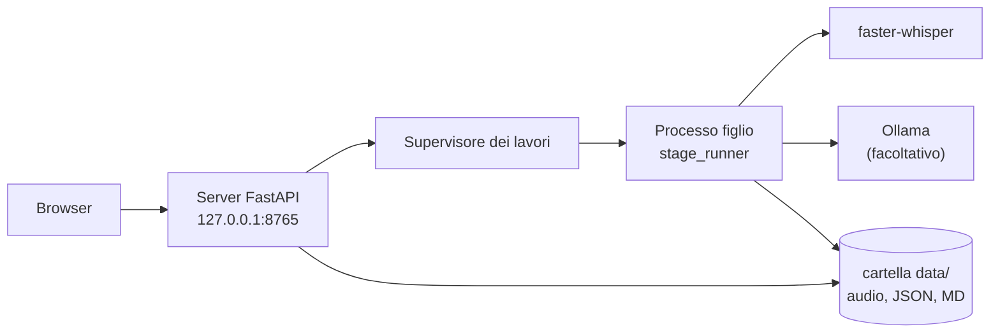

[English](./README.md) | **Italiano**

# Transcriber (sbobina)

Uno strumento per trascrivere in locale le lezioni registrate in italiano: audio e testo non escono mai dal tuo computer.


Registri la lezione col telefono, trascini il file in una pagina del browser e ottieni il testo diviso in paragrafi con l'orario. Le parole di cui il modello non è sicuro sono evidenziate, così sai quali passaggi riascoltare.

Sotto c'è [faster-whisper](https://github.com/SYSTRAN/faster-whisper) (Whisper large-v3 su scheda NVIDIA, large-v3-turbo sul processore). Un secondo passaggio facoltativo manda il testo a un LLM locale tramite [Ollama](https://ollama.com) per correggere le parole sentite male; l'LLM può solo sostituire brevi gruppi di parole, e ogni modifica finisce in un report delle correzioni. Interfaccia web e riga di comando usano la stessa pipeline.

**Non sei un utente tecnico?** Leggi la [guida utente](./docs/guida-utente.md): spiega passo per passo installazione e uso su Windows, macOS e Linux.

## In pratica

Avvio dell'interfaccia web su Linux con una RTX 4060 (`./avvia.sh`, che esegue `uv run sbobina web`):

```text
INFO Sistema linux: trascrivo con GPU NVIDIA (float16), modello large-v3. Motivo: GPU NVIDIA e librerie CUDA disponibili su linux.
INFO Modello large-v3 già scaricato.
INFO Ollama è pronto.
INFO Interfaccia su http://127.0.0.1:8765
```

Poi il browser si apre sulla pagina di caricamento.

Tempi misurati sull'hardware del progetto (da `src/sbobina/model_catalog.py`):

| Passaggio | Hardware | Tempo |
| --- | --- | --- |
| Trascrizione, lezione di 85 min, large-v3 | NVIDIA RTX 4060 8 GB | circa 6,5 min |
| Trascrizione, lezione di 90 min, large-v3-turbo | Intel Core i7 di 13ª generazione (solo processore) | circa 30 min |
| Correzione LLM, lezione di 85 min, qwen3.5:9b | NVIDIA RTX 4060 8 GB | circa 18 min |

## Funzionalità

- Interfaccia web su `127.0.0.1`: caricamento, coda dei lavori con avanzamento in tempo reale, storico, download dei modelli
- Lettore: clic su una parola per far ripartire l'audio da lì; parole incerte evidenziate; elenco dei passaggi da riascoltare
- Correzione a mano nel lettore: selezioni una parola o una frase, scrivi la correzione, salvi
- Esportazione in Markdown, JSON, DOCX e testo semplice (la copia DOCX/TXT non ha orari né segni di revisione)
- Correzione facoltativa con Ollama, limitata a sostituzioni, con report delle correzioni
- Confronto Word Error Rate (WER) con una trascrizione di riferimento fatta a mano
- Scelta automatica del dispositivo: CUDA se ci sono una scheda NVIDIA e le sue librerie, altrimenti processore

## Stack tecnologico

| Area | Componenti |
| --- | --- |
| Riconoscimento vocale | faster-whisper 1.2 (CTranslate2), librerie CUDA 12 da wheel pip (extra `cuda`) |
| Correzione del testo | client Ollama, modello locale `qwen3.5:9b` di default |
| Web | FastAPI, Uvicorn, template Jinja2, JavaScript senza framework, Server-Sent Events per l'avanzamento |
| Esportazione e metriche | python-docx, jiwer |
| Configurazione | pydantic-settings (variabili `SBOBINA_*` o file `.env`) |
| Strumenti | uv, pytest, ruff, mypy (strict) |

## Architettura



Ogni lavoro gira in un processo figlio, così un crash o un annullamento non fermano il server web. Al riavvio, i lavori rimasti in corso vengono segnati come interrotti. Tutto lo stato sta in file normali sotto `data/`.

## Prerequisiti

- [uv](https://docs.astral.sh/uv/). Gli script di avvio propongono di installarlo se manca; uv poi installa da solo Python 3.12.
- Facoltativo: una scheda NVIDIA con driver funzionante (Linux o Windows). Senza, la trascrizione usa il processore.
- Facoltativo: [Ollama](https://ollama.com/download) per la correzione.
- Circa 8 GB liberi su disco per ambiente e modelli.

Sviluppo e test avvengono su Linux. I percorsi per Windows e macOS sono implementati ma non ancora provati su macchine reali; [docs/checklist-windows-macos.md](./docs/checklist-windows-macos.md) è la lista di controllo per la prima prova.

## Installazione

1. Clona il repository:

   ```bash
   git clone https://github.com/AndreaBonn/speech-to-text.git
   cd speech-to-text
   ```

2. Avvialo. Su Linux e macOS:

   ```bash
   ./avvia.sh
   ```

   Su Windows, doppio clic su `avvia.bat`.

Lo script installa uv se serve (dopo averlo chiesto), aggiunge l'extra `cuda` quando `nvidia-smi` trova una scheda, prepara l'ambiente e apre `http://127.0.0.1:8765`. La prima trascrizione scarica il modello Whisper (circa 3 GB per large-v3, 1,6 GB per large-v3-turbo), a meno che tu non lo scarichi prima dalla pagina **Modelli**.

Preparazione manuale, senza gli script:

```bash
uv sync                  # solo processore
uv sync --extra cuda     # con scheda NVIDIA
uv run sbobina web
```

`./avvia.sh` accetta `--port N` e `--no-browser`, che passa a `sbobina web`.

## Configurazione

Ogni parametro ha un valore predefinito. Per cambiarne uno, copia `.env.example` in `.env` e modificalo, oppure imposta la variabile d'ambiente. Variabili principali (elenco completo in `src/sbobina/settings.py`):

| Nome | Obbligatoria | Descrizione |
| --- | --- | --- |
| `SBOBINA_WHISPER_MODEL` | ⚠️ | Modello Whisper; `auto` (default) sceglie il modello GPU o CPU qui sotto |
| `SBOBINA_WHISPER_MODEL_GPU` | ⚠️ | Modello usato con CUDA, default `large-v3` |
| `SBOBINA_WHISPER_MODEL_CPU` | ⚠️ | Modello usato sul processore, default `large-v3-turbo` |
| `SBOBINA_DEVICE` | ⚠️ | `auto`, `cuda` o `cpu` |
| `SBOBINA_COMPUTE_TYPE` | ⚠️ | Quantizzazione CTranslate2, `auto` di default |
| `SBOBINA_CPU_THREADS` | ⚠️ | Thread del processore, `0` = uno per core fisico |
| `SBOBINA_LANGUAGE` | ⚠️ | Lingua dell'audio, default `it` |
| `SBOBINA_BEAM_SIZE` | ⚠️ | Ampiezza della beam search, default `5` |
| `SBOBINA_VAD_FILTER` | ⚠️ | Silero VAD, `false` di default (sulle registrazioni lunghe da telefono perdeva parole) |
| `SBOBINA_CONDITION_ON_PREVIOUS_TEXT` | ⚠️ | `false` di default, per evitare ripetizioni in loop su audio di un'ora |
| `SBOBINA_UNCERTAIN_THRESHOLD` | ⚠️ | Le parole sotto questa confidenza vengono segnate, default `0.7` |
| `SBOBINA_OLLAMA_MODEL` | ⚠️ | Modello di correzione, default `qwen3.5:9b` |
| `SBOBINA_OLLAMA_HOST` | ⚠️ | Default `http://localhost:11434` |
| `SBOBINA_WEB_PORT` | ⚠️ | Default `8765` |
| `SBOBINA_DATA_DIR` | ⚠️ | Dove vengono salvati i lavori, default `data` |
| `SBOBINA_WEB_MAX_UPLOAD_MB` | ⚠️ | Limite di caricamento, default `1024` |

`SBOBINA_WEB_HOST` accetta solo `127.0.0.1`, `::1` o `localhost`: il server non può essere esposto in rete.

## Riga di comando

La stessa pipeline funziona senza interfaccia web:

| Comando | Cosa fa |
| --- | --- |
| `uv run sbobina trascrivi lezione.m4a -o sbobine/` | Trascrive; scrive `lezione.json` e `lezione.md` |
| `uv run sbobina rendi sbobine/lezione.json --soglia 0.8` | Rigenera il `.md` con un'altra soglia di incertezza, senza ritrascrivere |
| `uv run sbobina correggi sbobine/lezione.json --materia "diritto privato"` | Correzione con Ollama; scrive i file corretti e un report |
| `uv run sbobina wer riferimento.txt sbobine/lezione.json` | Word Error Rate rispetto a una trascrizione di riferimento |
| `uv run sbobina web [--port N] [--no-browser]` | Avvia l'interfaccia web |

Nel testo di riferimento per `wer` scrivi i numeri in cifre ("10 minuti"), come fa il modello, altrimenti vengono contati come errori.

## Struttura del repository

```text
speech-to-text/
├── src/sbobina/          # pacchetto: pipeline, CLI, correzione, esportazione
│   ├── prompts/          # prompt LLM versionati
│   └── web/              # app FastAPI, supervisore dei lavori, template, file statici
├── tests/                # suite pytest, rispecchia src/ (web/ per l'interfaccia)
├── docs/                 # guide utente, checklist multipiattaforma, report attività
├── specs/                # design e piano dell'interfaccia web
├── avvia.sh / avvia.bat  # avvio in un passo
└── .env.example          # impostazioni facoltative
```

## Testing

```bash
uv run pytest            # 478 test
uv run ruff check .
uv run mypy src tests
```

I test sostituiscono faster-whisper e Ollama con dei fake, quindi girano in pochi secondi senza trascrivere audio vero.

## Sicurezza

Il server ascolta solo sull'interfaccia di loopback e controlla gli header `Host` e `Origin`. Per segnalare una vulnerabilità, consulta [SECURITY.it.md](./SECURITY.it.md).

## Licenza

Distribuito con licenza Apache 2.0. Vedi [LICENSE](./LICENSE).

## Supporta il progetto

Se questo progetto ti è stato utile, lascia una stella su [GitHub](https://github.com/AndreaBonn/speech-to-text): aiuta altri studenti a trovarlo.
