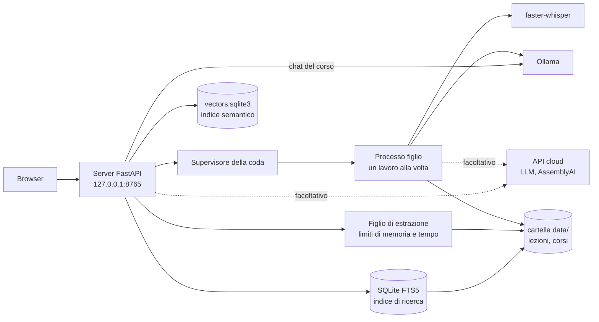

[English](./README.md) | **Italiano**

# Transcriber (sbobina)

Uno strumento per trascrivere e studiare le lezioni registrate in italiano. Gira sul tuo computer: con i motori predefiniti, audio e testo non ne escono mai.


[](https://github.com/AndreaBonn/speech-to-text/actions/workflows/ci.yml)
[](https://github.com/AndreaBonn/speech-to-text/actions/workflows/ci.yml)
[](https://github.com/AndreaBonn/speech-to-text/actions/workflows/ci.yml)

Registri la lezione col telefono, trascini il file in una pagina del browser e ottieni il testo diviso in paragrafi con l'orario. Le parole di cui il modello non è sicuro sono evidenziate, così sai quali passaggi riascoltare.

Sotto c'è [faster-whisper](https://github.com/SYSTRAN/faster-whisper) (Whisper large-v3 su scheda NVIDIA, large-v3-turbo sul processore). Un secondo passaggio facoltativo manda il testo a un LLM locale tramite [Ollama](https://ollama.com) per correggere le parole sentite male; l'LLM può solo sostituire brevi gruppi di parole, e ogni modifica finisce in un report delle correzioni. Interfaccia web e riga di comando usano la stessa pipeline.

I motori cloud sono facoltativi e si attivano dalla pagina **Impostazioni**: le funzioni sul testo possono usare Groq, Gemini, OpenAI o Anthropic, la trascrizione AssemblyAI. Ognuno chiede una tua chiave API e una conferma esplicita che il testo, o l'audio, verrà mandato a quel servizio. OCR e ricerca semantica restano sempre in locale.

Le lezioni sono raggruppate per corso. Ogni corso ha una pagina in cui aggiungi il materiale (libro, slide, appunti in PDF, DOCX, PPTX, TXT o Markdown), cerchi insieme nelle lezioni e nel materiale, generi esercitazioni e riassunti, svolgi le esercitazioni con la valutazione delle risposte e fai domande sul corso. Le frasi in cui il docente parla dell'esame vengono trovate da sole, e ciò che vuoi ricordare diventa una flashcard da ripassare con la ripetizione dilazionata. Tutto ciò che scrive l'LLM locale riporta la frase della lezione o la pagina del documento da cui è preso, e le voci con una citazione che non si trova nel materiale vengono scartate. Un corso si esporta in un pacchetto `.sbobina.zip` e si importa su un altro computer.

**Non sei un utente tecnico?** Leggi la [guida utente](./docs/guida-utente.md): spiega passo per passo installazione e uso su Windows, macOS e Linux.

## In pratica

Avvio dell'interfaccia web su Linux con una RTX 4060 (`./avvia.sh`, che esegue `uv run sbobina web`):

```text
INFO Sistema linux: trascrivo con GPU NVIDIA (float16), modello large-v3. Motivo: GPU NVIDIA e librerie CUDA disponibili su linux.
INFO Modello large-v3 già scaricato.
INFO Ollama è pronto.
INFO Interfaccia su http://127.0.0.1:8765
```

Poi il browser si apre sulla pagina di caricamento.

Tempi misurati sull'hardware del progetto (trascrizione e correzione da `src/sbobina/model_catalog.py`, funzioni dei corsi da `specs/001-course-workspace/eval*.md`, valutazione delle risposte da `specs/002-study-loop/eval-grading.md`, ricerca semantica da `specs/004-hybrid-retrieval/eval.md`):

| Passaggio | Hardware | Tempo |
| --- | --- | --- |
| Trascrizione, lezione di 85 min, large-v3 | NVIDIA RTX 4060 8 GB | circa 6,5 min |
| Trascrizione, lezione di 90 min, large-v3-turbo | Intel Core i7 di 13ª generazione (solo processore) | circa 30 min |
| Correzione LLM, lezione di 85 min, qwen3.5:9b | NVIDIA RTX 4060 8 GB | circa 18 min |
| Esercitazione (10 domande) o riassunto, qwen3.5:9b | NVIDIA RTX 4060 8 GB | da 33 a 84 s |
| Domanda sul corso, qwen3.5:9b, modello già caricato | NVIDIA RTX 4060 8 GB | mediana 10 s, massimo 17 s |
| Valutazione di una risposta aperta, qwen3.5:9b | NVIDIA RTX 4060 8 GB | mediana 8,3 s, massimo 21,5 s |
| OCR di una pagina scansionata, qwen2.5vl:7b | stessa macchina; il modello non sta in 8 GB e gira sul processore | da 4 a 5 min |
| Indicizzazione semantica di un corso, qwen3-embedding:8b | NVIDIA RTX 4060 8 GB, condivisa con altri lavori | da 0,85 a 1,71 passaggi al secondo (3.000 passaggi: da 30 a 60 min) |
| Domanda con ricerca semantica, qwen3-embedding:8b | stessa macchina, domanda calcolata sul processore | 95° percentile 2,0 s |

Sulle 82 domande del set di prova del progetto, la ricerca semantica trova il passaggio giusto nei primi 8 risultati per tutte, la ricerca per parole chiave (BM25) per il 56%.

## Funzionalità

- Interfaccia web su `127.0.0.1`: caricamento, coda dei lavori con avanzamento in tempo reale, storico, download dei modelli, tema chiaro e scuro
- Lettore: clic su una parola per far ripartire l'audio da lì; parole incerte evidenziate; elenco dei passaggi da riascoltare; flashcard da una frase selezionata
- Correzione a mano nel lettore: selezioni una parola o una frase, scrivi la correzione, salvi
- Esportazione in Markdown, JSON, DOCX e testo semplice (la copia DOCX/TXT non ha orari né segni di revisione)
- Correzione facoltativa con Ollama, limitata a sostituzioni, con report delle correzioni
- Corsi: lezioni raggruppate in base alla **Materia** scritta al caricamento, modificabile poi dal lettore
- Materiale del corso: caricamento di file PDF, DOCX, PPTX, TXT e Markdown; il tipo di file si controlla dal contenuto, non dal nome; i PDF scansionati si possono leggere con un modello visivo locale (OCR), un documento alla volta
- Ricerca testuale in tutte le lezioni e i documenti, filtrabile per corso; un risultato in una lezione apre il lettore a quel secondo
- Ricerca semantica per domande sul corso, esercitazioni e riassunti: i passaggi sono ordinati per significato con un modello di embedding locale, così una domanda trova il passaggio anche se usa altre parole. I corsi vengono indicizzati in sottofondo dopo ogni modifica del testo. Quando la ricerca semantica non può girare (modello non installato, corso non ancora indicizzato, GPU occupata dall'indicizzazione) la risposta ripiega sulle parole chiave e dice perché
- Esercitazioni (crocette, domande aperte, orale) e riassunti generati dal corso, con citazioni, scaricabili in Markdown e DOCX (compito e soluzioni in file separati)
- Svolgimento delle esercitazioni: crocette corrette subito; risposte aperte e orali valutate dall'LLM contro i punti della soluzione (Corretta, Parziale, Errata, con i punti coperti e quelli mancanti) oppure, sul processore, autovalutate; tentativi ripresi e punteggiati, errori raccolti per il ripasso
- Frasi da esame: le frasi in cui il docente segnala cosa chiederà ("all'esame", "vi chiederò", "ricordatevelo") trovate nelle trascrizioni con regole, senza LLM, e collegate al momento della lezione
- Ripasso: flashcard dal lettore, dai concetti dei materiali di studio, dalle frasi da esame e dagli errori delle esercitazioni, pianificate con FSRS; sessione giornaliera da tastiera; ogni carta ricontrolla se la sua fonte è cambiata
- Esportazione e importazione di un corso in un pacchetto `.sbobina.zip` (lezioni senza audio, materiali scelti, esercitazioni, carte), validato prima di scrivere su disco
- Formule matematiche rese con KaTeX in esercitazioni, riassunti, chat, materiali di studio, carte e testo da OCR
- Domande sul corso: chat in cui ogni frase della risposta cita un passaggio del materiale; se il materiale non copre la domanda, la risposta lo dice. Ogni risposta mostra quale modello l'ha scritta e se ha usato la ricerca semantica o per parole chiave
- Materiali di studio per lezione: riassunto, concetti chiave e possibili domande d'esame, ciascuno collegato al momento della lezione da cui viene
- Confronto Word Error Rate (WER) con una trascrizione di riferimento fatta a mano
- Scelta automatica del dispositivo: CUDA se ci sono una scheda NVIDIA e le sue librerie, altrimenti processore
- Pagina **Impostazioni**: motore per testi e studio (Ollama locale o cloud), ordine dei modelli cloud con Ollama come ultimo ripiego facoltativo, chiavi API con una verifica che non consuma token, motore di trascrizione (Whisper o AssemblyAI), ricerca semantica accesa o spenta e relativo modello
- Catena di ripiego cloud: se un servizio non risponde o ha superato il limite di richieste, la richiesta passa al modello successivo dell'elenco
- Trascrizione con AssemblyAI (facoltativa): l'audio viene caricato, trascritto e la copia remota cancellata; queste lezioni sono segnate nello storico
- Avvio con Docker: app e Ollama partono con un solo comando su Linux, Windows e macOS, su GPU o processore

## Stack tecnologico

| Area | Componenti |
| --- | --- |
| Riconoscimento vocale | faster-whisper 1.2 (CTranslate2), librerie CUDA 12 da wheel pip (extra `cuda`); API REST di AssemblyAI (facoltativa) |
| LLM locale | client Ollama; `qwen3.5:9b` per correzione, materiali di studio, esercitazioni, riassunti e chat; `qwen2.5vl:7b` per l'OCR; `qwen3-embedding:8b` per la ricerca semantica |
| LLM cloud (facoltativi) | API compatibile OpenAI (OpenAI, Groq, Gemini) e API Anthropic via httpx, in una catena di ripiego |
| Documenti | pypdfium2 (testo dei PDF e rendering delle pagine), python-docx, python-pptx, Pillow |
| Studio | fsrs 6 (pianificazione delle flashcard), KaTeX 0.19 incluso nel repository per le formule |
| Ricerca | indice SQLite FTS5 con ordinamento BM25, ricostruito dai file su disco; vettori di embedding in SQLite (`data/vectors.sqlite3`), similarità del coseno, reciprocal rank fusion fra lezioni e documenti |
| Web | FastAPI, Uvicorn, template Jinja2, JavaScript senza framework, Server-Sent Events per l'avanzamento |
| Esportazione e metriche | python-docx, jiwer |
| Configurazione | pydantic-settings (variabili `SBOBINA_*` o file `.env`); preferenze e chiavi API in file JSON nella cartella di configurazione dell'utente |
| Container | immagine Docker per linux/amd64 e linux/arm64, Docker Compose con Ollama 0.18 |
| Strumenti | uv, pytest, ruff, mypy (strict), GitHub Actions |

## Architettura



Trascrizioni, materiali di studio, esercitazioni, riassunti, OCR e indicizzazione semantica condividono una sola coda e girano uno alla volta in un processo figlio, così un crash o un annullamento non fermano il server web. Al riavvio, i lavori rimasti in corso vengono segnati come interrotti. L'estrazione del testo dai documenti caricati e l'importazione di un pacchetto di corso girano in altri processi figli con un limite di memoria (fuori da Windows); l'estrazione ha anche un tempo massimo. La chat del corso e la valutazione delle risposte girano nel processo web; un lock lettori-scrittore impedisce che usino la GPU nello stesso momento delle fasi di trascrizione e di indicizzazione. Tutto lo stato sta in file normali sotto `data/`; l'indice di ricerca si può cancellare e viene ricostruito alla ricerca successiva. Le scelte fatte nell'interfaccia e le chiavi API stanno fuori da `data/` e fuori dal repository, nella cartella di configurazione dell'utente (`~/.config/sbobina` su Linux, `~/Library/Application Support/sbobina` su macOS, `%APPDATA%\sbobina` su Windows), così né l'esportazione di un corso né un clone git le portano con sé.

## Prerequisiti

- [uv](https://docs.astral.sh/uv/). Gli script di avvio propongono di installarlo se manca; uv poi installa da solo Python 3.12.
- Facoltativo: una scheda NVIDIA con driver funzionante (Linux o Windows). Senza, la trascrizione usa il processore.
- Facoltativo: [Ollama](https://ollama.com/download), che serve per correzione, materiali di studio, esercitazioni, riassunti, domande sul corso e OCR. Trascrizione, lettore, ricerca ed esportazione funzionano anche senza. I modelli Ollama si scaricano dalla pagina **Modelli**; correzione, esercitazioni, riassunti e OCR scaricano il proprio anche al primo uso.
- Facoltativo, per la ricerca semantica: il modello Ollama `qwen3-embedding:8b` (`ollama pull qwen3-embedding:8b`; la pagina **Impostazioni** mostra il comando). Senza, la ricerca usa solo le parole chiave.
- Facoltativo: una chiave API per ogni servizio cloud che vuoi usare.
- Circa 8 GB liberi su disco per ambiente e modello Whisper, più lo spazio di ogni modello Ollama che usi (circa 6 GB per `qwen3.5:9b`).
- In alternativa a tutto quanto sopra, tranne il driver della scheda: [Docker](https://docs.docker.com/get-docker/), vedi [Con Docker](#con-docker).

Sviluppo e test avvengono su Linux. I percorsi per Windows e macOS sono implementati ma non ancora provati su macchine reali; [docs/checklist-windows-macos.md](./docs/checklist-windows-macos.md) è la lista di controllo per la prima prova.

## Installazione

1. Clona il repository:

   ```bash
   git clone https://github.com/AndreaBonn/speech-to-text.git
   cd speech-to-text
   ```

2. Avvialo. Su Linux e macOS:

   ```bash
   ./avvia.sh
   ```

   Su Windows, doppio clic su `avvia.bat`.

Lo script installa uv se serve (dopo averlo chiesto), aggiunge l'extra `cuda` quando `nvidia-smi` trova una scheda, prepara l'ambiente e apre `http://127.0.0.1:8765`. La prima trascrizione scarica il modello Whisper (circa 3 GB per large-v3, 1,6 GB per large-v3-turbo), a meno che tu non lo scarichi prima dalla pagina **Modelli**.

Preparazione manuale, senza gli script:

```bash
uv sync                  # solo processore
uv sync --extra cuda     # con scheda NVIDIA
uv run sbobina web
```

`./avvia.sh` accetta `--port N` e `--no-browser`, che passa a `sbobina web`.

### Con Docker

Per chi ha dimestichezza con Docker. Gli script di avvio qui sopra restano la strada principale; questa evita di installare Python, uv e Ollama sulla macchina. Dalla cartella del repository, su Linux, Windows e macOS:

```bash
docker compose up -d
```

Poi apri `http://127.0.0.1:8765`. Il primo avvio costruisce l'immagine (circa 4,6 GB su x86, quasi tutti per le librerie CUDA) e avvia due container, l'app e Ollama 0.18. I messaggi di avvio si leggono con `docker compose logs -f app`; `docker compose down` ferma tutto.

Senza altre impostazioni entrambi i container usano il processore. Con una scheda NVIDIA, crea un file `.env` accanto a `compose.yaml` con queste due righe, poi lancia lo stesso comando:

```text
COMPOSE_PATH_SEPARATOR=:
COMPOSE_FILE=compose.yaml:compose.gpu.yaml
```

La GPU richiede il driver NVIDIA sulla macchina, più il [NVIDIA Container Toolkit](https://docs.nvidia.com/datacenter/cloud-native/container-toolkit/latest/install-guide.html) su Linux, o Docker Desktop con WSL2 su Windows. Docker su macOS non accede alla GPU: lì usa sempre il processore, più lento dello script di avvio.

Lezioni e corsi, modelli Whisper, impostazioni e chiavi API salvate, e modelli Ollama stanno in quattro volumi Docker con nome (`data`, `whisper-models`, `config`, `ollama-models`). Restano dopo `docker compose down`; `docker compose down -v` li cancella. La pagina è pubblicata solo su `127.0.0.1`, e la porta deve restare 8765, perché il server accetta richieste solo da quell'origine.

Provato su Linux con una RTX 4060, dove una trascrizione su GPU nel container ha dato lo stesso testo dell'esecuzione nativa. Docker Desktop su Windows e l'immagine arm64 per Apple Silicon non sono ancora stati provati.

## Configurazione

Ogni parametro ha un valore predefinito. Motori, ordine dei modelli, chiavi API, motore di trascrizione e ricerca semantica si impostano dalla pagina **Impostazioni**. Tutto il resto si imposta copiando `.env.example` in `.env` e modificandolo, oppure con la variabile d'ambiente. Una variabile d'ambiente vince sulla scelta salvata nella pagina, che mostra quel campo come bloccato. Variabili principali (elenco completo in `src/sbobina/settings.py`):

| Nome | Obbligatoria | Descrizione |
| --- | --- | --- |
| `SBOBINA_WHISPER_MODEL` | ⚠️ | Modello Whisper; `auto` (default) sceglie il modello GPU o CPU qui sotto |
| `SBOBINA_WHISPER_MODEL_GPU` | ⚠️ | Modello usato con CUDA, default `large-v3` |
| `SBOBINA_WHISPER_MODEL_CPU` | ⚠️ | Modello usato sul processore, default `large-v3-turbo` |
| `SBOBINA_DEVICE` | ⚠️ | `auto`, `cuda` o `cpu` |
| `SBOBINA_COMPUTE_TYPE` | ⚠️ | Quantizzazione CTranslate2, `auto` di default |
| `SBOBINA_CPU_THREADS` | ⚠️ | Thread del processore, `0` = uno per core fisico |
| `SBOBINA_LANGUAGE` | ⚠️ | Lingua dell'audio, default `it` |
| `SBOBINA_BEAM_SIZE` | ⚠️ | Ampiezza della beam search, default `5` |
| `SBOBINA_VAD_FILTER` | ⚠️ | Silero VAD, `false` di default (sulle registrazioni lunghe da telefono perdeva parole) |
| `SBOBINA_CONDITION_ON_PREVIOUS_TEXT` | ⚠️ | `false` di default, per evitare ripetizioni in loop su audio di un'ora |
| `SBOBINA_UNCERTAIN_THRESHOLD` | ⚠️ | Le parole sotto questa confidenza vengono segnate, default `0.7` |
| `SBOBINA_OLLAMA_MODEL` | ⚠️ | Modello testuale per correzione, materiali di studio, esercitazioni, riassunti e chat, default `qwen3.5:9b` |
| `SBOBINA_OLLAMA_HOST` | ⚠️ | Default `http://localhost:11434` |
| `SBOBINA_OCR_MODEL` | ⚠️ | Modello visivo per i PDF scansionati, default `qwen2.5vl:7b` |
| `SBOBINA_OCR_SCALE` | ⚠️ | Scala di rendering delle pagine per l'OCR, default `1.0` (a `2.0` una pagina richiedeva oltre 10 min sul processore) |
| `SBOBINA_CHAT_TIMEOUT_S` | ⚠️ | Attesa massima per una risposta della chat, default `120` |
| `SBOBINA_PRACTICE_GRADING_MODE` | ⚠️ | Valutazione delle risposte aperte: `judge` (LLM), `self` (autovalutazione) o `auto` (default: LLM con CUDA, autovalutazione sul processore) |
| `SBOBINA_REVIEW_NEW_PER_DAY` | ⚠️ | Carte nuove al giorno per corso nel Ripasso, default `20` |
| `SBOBINA_WEB_PORT` | ⚠️ | Default `8765` |
| `SBOBINA_DATA_DIR` | ⚠️ | Dove vengono salvati lezioni e corsi, default `data` |
| `SBOBINA_WEB_MAX_UPLOAD_MB` | ⚠️ | Limite di caricamento dell'audio, default `1024` |
| `SBOBINA_COURSE_DOC_MAX_MB` | ⚠️ | Limite di caricamento dei documenti del corso, default `200` |
| `SBOBINA_LLM_ENGINE` | ⚠️ | `local` (Ollama, default) o `api` (catena cloud) |
| `SBOBINA_LLM_CHAIN` | ⚠️ | Modelli cloud in ordine, in JSON, es. `[{"provider": "groq", "model": "..."}]`; servizi `groq`, `gemini`, `openai`, `anthropic`, al massimo 8 |
| `SBOBINA_LLM_OLLAMA_FALLBACK` | ⚠️ | Usa Ollama locale come ultimo anello della catena, default `true` |
| `SBOBINA_CLOUD_TIMEOUT_S` | ⚠️ | Tempo massimo di una richiesta cloud, default `60` |
| `SBOBINA_TRANSCRIPTION_ENGINE` | ⚠️ | `whisper` (default) o `assemblyai` |
| `SBOBINA_GROQ_API_KEY`, `SBOBINA_GEMINI_API_KEY`, `SBOBINA_OPENAI_API_KEY`, `SBOBINA_ANTHROPIC_API_KEY`, `SBOBINA_ASSEMBLYAI_API_KEY` | ⚠️ | Chiavi API; se impostate, vincono sulle chiavi salvate nella pagina |
| `SBOBINA_SEMANTIC_SEARCH` | ⚠️ | Ricerca semantica, default `true` |
| `SBOBINA_EMBEDDING_MODEL` | ⚠️ | Modello di embedding di Ollama, default `qwen3-embedding:8b` |
| `SBOBINA_EMBEDDING_TIMEOUT_S` | ⚠️ | Attesa massima per l'embedding di una domanda, default `30` |
| `SBOBINA_CONFIG_DIR` | ⚠️ | Cartella per impostazioni e chiavi API salvate; rifiutata se sta dentro la cartella dei dati o nel repository |
| `SBOBINA_WEB_BIND_HOST` | ⚠️ | `0.0.0.0` o `::` per ascoltare su tutte le interfacce; accettato solo dentro un container (lo imposta l'immagine Docker) |

`SBOBINA_WEB_HOST` accetta solo `127.0.0.1`, `::1` o `localhost`: il server non può essere esposto in rete. `SBOBINA_WEB_BIND_HOST` esiste per Docker: il container ascolta su tutte le interfacce della propria rete, Compose pubblica la porta solo sul `127.0.0.1` della macchina, e fuori da un container il server con quell'impostazione si rifiuta di partire.

## Riga di comando

La pipeline di trascrizione e l'indicizzazione semantica funzionano senza interfaccia web. Le altre funzioni dei corsi (materiale, ricerca, esercitazioni, chat, OCR, frasi da esame, Ripasso, esportazione e importazione) e la pagina **Impostazioni** sono disponibili solo nell'interfaccia web.

| Comando | Cosa fa |
| --- | --- |
| `uv run sbobina trascrivi lezione.m4a -o sbobine/` | Trascrive; scrive `lezione.json` e `lezione.md` |
| `uv run sbobina rendi sbobine/lezione.json --soglia 0.8` | Rigenera il `.md` con un'altra soglia di incertezza, senza ritrascrivere |
| `uv run sbobina correggi sbobine/lezione.json --materia "diritto privato"` | Correzione con Ollama; scrive i file corretti e un report |
| `uv run sbobina studio sbobine/lezione.json` | Materiali di studio con citazioni; scrive `lezione.studio.json` e `lezione.studio.md` |
| `uv run sbobina wer riferimento.txt sbobine/lezione.json` | Word Error Rate rispetto a una trascrizione di riferimento |
| `uv run sbobina indicizza-semantico --corso CHIAVE` | Costruisce l'indice semantico di un corso (`--tutti` per tutti i corsi) |
| `uv run sbobina indicizza-semantico --backfill` | Mette in coda i corsi con indice mancante o incompleto; il lavoro parte al successivo avvio di `sbobina web`. Aggiungi `--conferma-cambio-modello` per ricostruire dopo un cambio del modello di embedding |
| `uv run sbobina web [--port N] [--no-browser]` | Avvia l'interfaccia web |

Nel testo di riferimento per `wer` scrivi i numeri in cifre ("10 minuti"), come fa il modello, altrimenti vengono contati come errori.

## Struttura del repository

```text
speech-to-text/
├── src/sbobina/          # pacchetto: pipeline, CLI, correzione, recupero, generazioni, esportazione
│   ├── prompts/          # prompt LLM versionati
│   └── web/              # app FastAPI, supervisore della coda, archivi, template, file statici
├── tests/                # suite pytest, rispecchia src/ (web/ per l'interfaccia)
├── docs/                 # guide utente, checklist multipiattaforma, report attività
├── specs/                # design, piani e misure (interfaccia web, materiali di studio, spazio del corso, ciclo di studio, servizi cloud, ricerca semantica)
├── scripts/              # script di valutazione e verifica (recupero, citazioni, resa delle formule, badge)
├── avvia.sh / avvia.bat  # avvio in un passo
├── Dockerfile            # immagine multi-architettura dell'interfaccia web
├── compose.yaml          # app + Ollama su processore; compose.gpu.yaml aggiunge la scheda NVIDIA
└── .env.example          # impostazioni facoltative
```

## Testing

```bash
uv run pytest            # 3369 test
uv run ruff check .
uv run mypy src tests
```

I test sostituiscono faster-whisper, Ollama e le API cloud con dei fake, quindi girano senza trascrivere audio vero, caricare un modello o chiamare un servizio a pagamento. GitHub Actions esegue lint, controllo del formato, mypy e test a ogni push e pull request su `main`.

## Sicurezza

Il server ascolta solo sull'interfaccia di loopback, controlla gli header `Host` e `Origin` e manda una Content-Security-Policy con le pagine HTML. I documenti caricati vengono letti in un processo figlio con limiti di dimensione, memoria e tempo, e i pacchetti di corso importati vengono validati prima di scrivere qualsiasi file. I motori cloud restano spenti finché non confermi nella pagina che testo o audio verranno mandati fuori. Le chiavi API stanno fuori dalla cartella dei dati, in un file leggibile solo dal tuo utente su Linux e macOS (`0600`), e sono mascherate nei log. Per segnalare una vulnerabilità, consulta [SECURITY.it.md](./SECURITY.it.md).

## Licenza

Distribuito con licenza Apache 2.0. Vedi [LICENSE](./LICENSE).

## Supporta il progetto

Se questo progetto ti è stato utile, lascia una stella su [GitHub](https://github.com/AndreaBonn/speech-to-text): aiuta altri studenti a trovarlo.

Transcriber è gratuito. Se ti è utile e vuoi contribuire, puoi lasciare un'offerta tramite PayPal. L'importo lo scegli tu ed è del tutto facoltativo.

<p align="center">
  <a href="https://paypal.me/AndreaBonacci19"></a>
</p>
