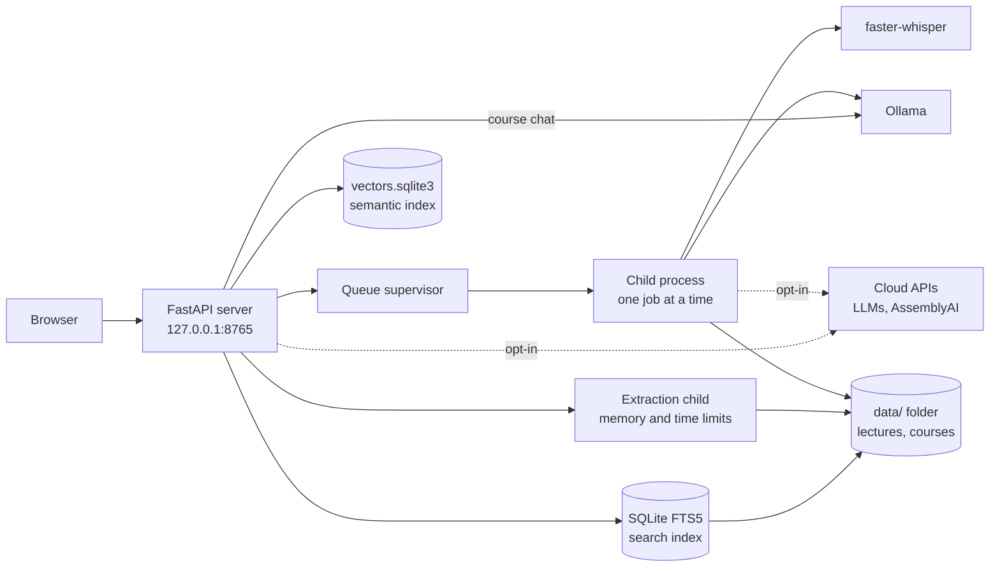

**English** | [Italiano](./README.it.md)

# Transcriber (sbobina)

A transcription and study tool for recorded lectures in Italian. It runs on your computer: with the default engines, audio and text never leave it.


[](https://github.com/AndreaBonn/speech-to-text/actions/workflows/ci.yml)
[](https://github.com/AndreaBonn/speech-to-text/actions/workflows/ci.yml)
[](https://github.com/AndreaBonn/speech-to-text/actions/workflows/ci.yml)

You record a lecture with your phone, drop the file into a page in your browser, and get the text back, split into paragraphs with timestamps. Words the model is unsure about are highlighted, so you know which passages to listen to again.

Under the hood it runs [faster-whisper](https://github.com/SYSTRAN/faster-whisper) (Whisper large-v3 on an NVIDIA GPU, large-v3-turbo on the CPU). An optional second pass sends the text to a local LLM through [Ollama](https://ollama.com) to fix misheard words; the LLM may only substitute short word spans, and every edit is listed in a corrections report. The web UI and the command line share the same pipeline.

Cloud engines are opt-in, from the **Impostazioni** (Settings) page: text features can run on Groq, Gemini, OpenAI or Anthropic, and transcription on AssemblyAI. Each needs your own API key and an explicit confirmation that text, or audio, will be sent to that service. OCR and semantic search always stay local.

Lectures are grouped by course. Each course has a page where you add the course material (book, slides, notes as PDF, DOCX, PPTX, TXT or Markdown), search lectures and material together, generate practice exams and summaries, take the exams with graded answers, and ask questions about the course. Sentences where the lecturer talks about the exam are found automatically, and anything you want to remember becomes a flashcard reviewed with spaced repetition. Everything the local LLM writes comes with the sentence of the lecture or the page of the document it is taken from, and items whose quote cannot be found in the material are dropped. A course can be exported to a `.sbobina.zip` package and imported on another computer.

**Not a technical user?** Read the [user guide](./docs/user-guide.md): it covers installation and everyday use on Windows, macOS and Linux, step by step.

## In practice

Starting the web UI on a Linux machine with an RTX 4060 (`./avvia.sh`, which runs `uv run sbobina web`):

```text
INFO Sistema linux: trascrivo con GPU NVIDIA (float16), modello large-v3. Motivo: GPU NVIDIA e librerie CUDA disponibili su linux.
INFO Modello large-v3 già scaricato.
INFO Ollama è pronto.
INFO Interfaccia su http://127.0.0.1:8765
```

The browser then opens on the upload page. Messages are in Italian because the intended users are Italian students.

Measured on this project's hardware (transcription and correction from `src/sbobina/model_catalog.py`, course features from `specs/001-course-workspace/eval*.md`, answer grading from `specs/002-study-loop/eval-grading.md`, semantic search from `specs/004-hybrid-retrieval/eval.md`):

| Step | Hardware | Time |
| --- | --- | --- |
| Transcription, 85-min lecture, large-v3 | NVIDIA RTX 4060 8 GB | about 6.5 min |
| Transcription, 90-min lecture, large-v3-turbo | Intel Core i7, 13th gen (CPU only) | about 30 min |
| LLM correction, 85-min lecture, qwen3.5:9b | NVIDIA RTX 4060 8 GB | about 18 min |
| Practice exam (10 questions) or summary, qwen3.5:9b | NVIDIA RTX 4060 8 GB | 33 to 84 s |
| Course question, qwen3.5:9b, model already loaded | NVIDIA RTX 4060 8 GB | median 10 s, slowest 17 s |
| Grading one open answer, qwen3.5:9b | NVIDIA RTX 4060 8 GB | median 8.3 s, slowest 21.5 s |
| OCR of one scanned page, qwen2.5vl:7b | same machine; the model does not fit in 8 GB and runs on the CPU | 4 to 5 min |
| Semantic indexing of a course, qwen3-embedding:8b | NVIDIA RTX 4060 8 GB, shared with other work | 0.85 to 1.71 passages per second (3,000 passages: 30 to 60 min) |
| Semantic search query, qwen3-embedding:8b | same machine, query embedded on the CPU | 95th percentile 2.0 s |

On the 82 questions of the project's retrieval test set, semantic search finds the right passage in the first 8 results for all of them, keyword search (BM25) for 56%.

## Features

- Web UI on `127.0.0.1`: upload, job queue with live progress, history, model downloads, light and dark theme
- Reader: click a word to play the audio from that point; uncertain words highlighted; list of passages to re-listen; flashcards from a selected phrase
- Manual correction in the reader: select a word or a phrase, type the fix, save
- Exports: Markdown, JSON, DOCX and plain text (the DOCX/TXT copy has no timestamps or review marks)
- Optional Ollama correction with substitution-only guards and a corrections report
- Courses: lectures grouped by the **Materia** typed at upload, editable later from the reader
- Course material: upload PDF, DOCX, PPTX, TXT and Markdown files; the file type is checked from its content, not its name; scanned PDFs can be read with a local vision model (OCR), one document at a time
- Full-text search over every lecture and document, filtered by course; a lecture hit opens the reader at that second
- Semantic search for course questions, exams and summaries: passages are ranked by meaning with a local embedding model, so a question finds the passage even when it uses other words. Courses are indexed in the background after every text change. When semantic search cannot run (model not installed, course not yet indexed, GPU busy with indexing) the answer falls back to keyword search and says why
- Practice exams (multiple choice, open questions, oral) and summaries generated from the course, with citations, downloadable as Markdown and DOCX (exam and solutions as separate files)
- Taking practice exams: multiple choice checked at once; open and oral answers graded by the LLM against the solution points (correct, partial, wrong, with covered and missing points) or, on the CPU, self-graded; attempts can be resumed and are scored, mistakes are collected for review
- Exam cues: sentences where the lecturer signals what will be asked ("all'esame", "vi chiederò", "ricordatevelo") found in transcripts by rules, without an LLM, and linked to their moment in the lecture
- Review: flashcards from the reader, from study-note concepts, from exam cues and from practice mistakes, scheduled with FSRS; daily keyboard-driven session; each card rechecks whether its source changed
- Course export and import as a `.sbobina.zip` package (lectures without audio, chosen material, practice exams, cards), validated before anything is written to disk
- Math formulas rendered with KaTeX in exams, summaries, chat, study notes, cards and OCR text
- Course questions: chat in which every sentence of the answer cites a passage of the material; if the material does not cover the question, the answer says so. Each answer shows which model wrote it and whether it used semantic or keyword search
- Study notes per lecture: summary, key concepts and likely exam questions, each linked to the lecture time it comes from
- Word Error Rate (WER) comparison against a hand-made reference transcript
- Automatic device choice: CUDA when an NVIDIA GPU and its libraries are available, CPU otherwise
- **Impostazioni** (Settings) page: engine for text and study features (local Ollama or cloud), order of the cloud models with Ollama as optional last fallback, API keys with a check that spends no tokens, transcription engine (Whisper or AssemblyAI), semantic search on/off and its model
- Cloud fallback chain: if a provider is down or rate-limited, the request moves to the next model in the list
- AssemblyAI transcription (opt-in): the audio is uploaded, transcribed, and the remote copy is deleted; such lectures are marked in the history
- Docker setup: app and Ollama started with one command on Linux, Windows and macOS, on the GPU or the CPU

## Tech stack

| Area | Components |
| --- | --- |
| Speech recognition | faster-whisper 1.2 (CTranslate2), CUDA 12 libraries from pip wheels (`cuda` extra); AssemblyAI REST API (opt-in) |
| Local LLM | Ollama client; `qwen3.5:9b` for correction, study notes, exams, summaries and chat; `qwen2.5vl:7b` for OCR; `qwen3-embedding:8b` for semantic search |
| Cloud LLM (opt-in) | OpenAI-compatible API (OpenAI, Groq, Gemini) and Anthropic API over httpx, in a fallback chain |
| Documents | pypdfium2 (PDF text and page rendering), python-docx, python-pptx, Pillow |
| Study | fsrs 6 (flashcard scheduling), KaTeX 0.19 vendored for formulas |
| Search | SQLite FTS5 index with BM25 ranking, rebuilt from the files on disk; embedding vectors in SQLite (`data/vectors.sqlite3`), cosine similarity, reciprocal rank fusion between lectures and documents |
| Web | FastAPI, Uvicorn, Jinja2 templates, vanilla JavaScript, Server-Sent Events for progress |
| Exports and metrics | python-docx, jiwer |
| Configuration | pydantic-settings (`SBOBINA_*` environment variables or `.env`); preferences and API keys in JSON files in the user config folder |
| Containers | Docker image for linux/amd64 and linux/arm64, Docker Compose with Ollama 0.18 |
| Tooling | uv, pytest, ruff, mypy (strict), GitHub Actions |

## Architecture



Transcriptions, study notes, exams, summaries, OCR runs and semantic indexing share one queue and run one at a time in a child process, so a crash or a cancel does not take the web server down. On restart, jobs left running are marked as interrupted. Text extraction from uploaded documents and course package imports run in other child processes with a memory limit (outside Windows); extraction also has a timeout. Course chat and answer grading run in the web process; a readers-writer lock keeps them from using the GPU at the same time as the transcription and indexing stages. All state lives in plain files under `data/`; the search index can be deleted and is rebuilt on the next search. Settings chosen in the UI and API keys are kept outside `data/` and outside the repository, in the user config folder (`~/.config/sbobina` on Linux, `~/Library/Application Support/sbobina` on macOS, `%APPDATA%\sbobina` on Windows), so a course export or a git clone never carries them.

## Prerequisites

- [uv](https://docs.astral.sh/uv/). The launch scripts offer to install it if missing; uv then installs Python 3.12 by itself.
- Optional: an NVIDIA GPU with a working driver (Linux or Windows). Without it, transcription runs on the CPU.
- Optional: [Ollama](https://ollama.com/download), needed for correction, study notes, exams, summaries, course questions and OCR. Transcription, reader, search and exports work without it. Ollama models can be downloaded from the **Modelli** page; correction, exams, summaries and OCR also download their model on first use.
- Optional, for semantic search: the Ollama model `qwen3-embedding:8b` (`ollama pull qwen3-embedding:8b`; the **Impostazioni** page shows the command). Without it, search uses keywords only.
- Optional: an API key for each cloud service you want to use.
- About 8 GB of free disk space for the environment and the Whisper model, plus the space of each Ollama model you use (about 6 GB for `qwen3.5:9b`).
- Alternative to all of the above except the GPU driver: [Docker](https://docs.docker.com/get-docker/), see [With Docker](#with-docker).

Development and testing happen on Linux. The Windows and macOS paths are implemented but have not yet been run on real machines; [docs/checklist-windows-macos.md](./docs/checklist-windows-macos.md) is the checklist for the first test.

## Installation

1. Clone the repository:

   ```bash
   git clone https://github.com/AndreaBonn/speech-to-text.git
   cd speech-to-text
   ```

2. Start it. On Linux and macOS:

   ```bash
   ./avvia.sh
   ```

   On Windows, double-click `avvia.bat`.

The script installs uv if needed (after asking), adds the `cuda` extra when `nvidia-smi` finds a GPU, prepares the environment and opens `http://127.0.0.1:8765`. The first transcription downloads the Whisper model (about 3 GB for large-v3, 1.6 GB for large-v3-turbo) unless you download it first from the **Modelli** page.

Manual setup, without the scripts:

```bash
uv sync                  # CPU only
uv sync --extra cuda     # with an NVIDIA GPU
uv run sbobina web
```

`./avvia.sh` accepts `--port N` and `--no-browser`, passed through to `sbobina web`.

### With Docker

For users comfortable with Docker. The launch scripts above remain the main path; this one avoids installing Python, uv and Ollama on the machine. From the repository folder, on Linux, Windows and macOS:

```bash
docker compose up -d
```

Then open `http://127.0.0.1:8765`. The first run builds the image (about 4.6 GB on x86, most of it the CUDA libraries) and starts two containers, the app and Ollama 0.18. Startup messages are in `docker compose logs -f app`; `docker compose down` stops everything.

Without further setup both containers run on the CPU. With an NVIDIA GPU, create a `.env` file next to `compose.yaml` with these two lines, then run the same command:

```text
COMPOSE_PATH_SEPARATOR=:
COMPOSE_FILE=compose.yaml:compose.gpu.yaml
```

The GPU needs the NVIDIA driver on the host, plus the [NVIDIA Container Toolkit](https://docs.nvidia.com/datacenter/cloud-native/container-toolkit/latest/install-guide.html) on Linux, or Docker Desktop with WSL2 on Windows. Docker on macOS has no GPU access: there it always runs on the CPU, slower than the launch script.

Lectures and courses, Whisper models, saved settings and API keys, and Ollama models live in four named volumes (`data`, `whisper-models`, `config`, `ollama-models`). They survive `docker compose down`; `docker compose down -v` deletes them. The page is published on `127.0.0.1` only, and the port must stay 8765, because the server accepts requests only from that origin.

Tested on Linux with an RTX 4060, where a GPU transcription in the container gave the same text as the native run. Docker Desktop on Windows and the arm64 image for Apple Silicon have not been tested yet.

## Configuration

Every setting has a default. Engines, model order, API keys, transcription engine and semantic search are set from the **Impostazioni** page. Everything else is set by copying `.env.example` to `.env` and editing it, or by setting the environment variable. An environment variable wins over the choice saved in the page, and the page shows that field as locked. Main variables (full list in `src/sbobina/settings.py`):

| Name | Required | Description |
| --- | --- | --- |
| `SBOBINA_WHISPER_MODEL` | ⚠️ | Whisper model; `auto` (default) picks the GPU or CPU model below |
| `SBOBINA_WHISPER_MODEL_GPU` | ⚠️ | Model used on CUDA, default `large-v3` |
| `SBOBINA_WHISPER_MODEL_CPU` | ⚠️ | Model used on CPU, default `large-v3-turbo` |
| `SBOBINA_DEVICE` | ⚠️ | `auto`, `cuda` or `cpu` |
| `SBOBINA_COMPUTE_TYPE` | ⚠️ | CTranslate2 quantization, `auto` by default |
| `SBOBINA_CPU_THREADS` | ⚠️ | CPU threads, `0` = one per physical core |
| `SBOBINA_LANGUAGE` | ⚠️ | Audio language, default `it` |
| `SBOBINA_BEAM_SIZE` | ⚠️ | Beam search width, default `5` |
| `SBOBINA_VAD_FILTER` | ⚠️ | Silero VAD, `false` by default (it dropped words on long phone recordings) |
| `SBOBINA_CONDITION_ON_PREVIOUS_TEXT` | ⚠️ | `false` by default, to avoid repetition loops on hour-long audio |
| `SBOBINA_UNCERTAIN_THRESHOLD` | ⚠️ | Words below this confidence are flagged, default `0.7` |
| `SBOBINA_OLLAMA_MODEL` | ⚠️ | Text model for correction, study notes, exams, summaries and chat, default `qwen3.5:9b` |
| `SBOBINA_OLLAMA_HOST` | ⚠️ | Default `http://localhost:11434` |
| `SBOBINA_OCR_MODEL` | ⚠️ | Vision model for scanned PDFs, default `qwen2.5vl:7b` |
| `SBOBINA_OCR_SCALE` | ⚠️ | Page render scale for OCR, default `1.0` (at `2.0` a page took over 10 min on the CPU) |
| `SBOBINA_CHAT_TIMEOUT_S` | ⚠️ | Maximum wait for a chat answer, default `120` |
| `SBOBINA_PRACTICE_GRADING_MODE` | ⚠️ | Grading of open answers: `judge` (LLM), `self` (self-grading) or `auto` (default: LLM with CUDA, self-grading on the CPU) |
| `SBOBINA_REVIEW_NEW_PER_DAY` | ⚠️ | New review cards per day per course, default `20` |
| `SBOBINA_WEB_PORT` | ⚠️ | Default `8765` |
| `SBOBINA_DATA_DIR` | ⚠️ | Where lectures and courses are stored, default `data` |
| `SBOBINA_WEB_MAX_UPLOAD_MB` | ⚠️ | Audio upload limit, default `1024` |
| `SBOBINA_COURSE_DOC_MAX_MB` | ⚠️ | Course document upload limit, default `200` |
| `SBOBINA_LLM_ENGINE` | ⚠️ | `local` (Ollama, default) or `api` (cloud chain) |
| `SBOBINA_LLM_CHAIN` | ⚠️ | Ordered cloud models as JSON, e.g. `[{"provider": "groq", "model": "..."}]`; providers `groq`, `gemini`, `openai`, `anthropic`, at most 8 |
| `SBOBINA_LLM_OLLAMA_FALLBACK` | ⚠️ | Use local Ollama as the last link of the chain, default `true` |
| `SBOBINA_CLOUD_TIMEOUT_S` | ⚠️ | Timeout of a cloud request, default `60` |
| `SBOBINA_TRANSCRIPTION_ENGINE` | ⚠️ | `whisper` (default) or `assemblyai` |
| `SBOBINA_GROQ_API_KEY`, `SBOBINA_GEMINI_API_KEY`, `SBOBINA_OPENAI_API_KEY`, `SBOBINA_ANTHROPIC_API_KEY`, `SBOBINA_ASSEMBLYAI_API_KEY` | ⚠️ | API keys; if set, they win over the keys saved in the page |
| `SBOBINA_SEMANTIC_SEARCH` | ⚠️ | Semantic search, default `true` |
| `SBOBINA_EMBEDDING_MODEL` | ⚠️ | Ollama embedding model, default `qwen3-embedding:8b` |
| `SBOBINA_EMBEDDING_TIMEOUT_S` | ⚠️ | Maximum wait for a query embedding, default `30` |
| `SBOBINA_CONFIG_DIR` | ⚠️ | Folder for saved settings and API keys; refused if it is inside the data folder or the repository |
| `SBOBINA_WEB_BIND_HOST` | ⚠️ | `0.0.0.0` or `::` to listen on every interface; accepted only inside a container (the Docker image sets it) |

`SBOBINA_WEB_HOST` accepts only `127.0.0.1`, `::1` or `localhost`: the server cannot be exposed on the network. `SBOBINA_WEB_BIND_HOST` exists for Docker: the container listens on every interface of its own network, Compose publishes the port on the host's `127.0.0.1` only, and outside a container the server refuses to start with that setting.

## Command line

The transcription pipeline and semantic indexing run without the web UI. Other course features (material, search, exams, chat, OCR, exam cues, review, export and import) and the **Impostazioni** page are available only in the web UI.

| Command | What it does |
| --- | --- |
| `uv run sbobina trascrivi lezione.m4a -o sbobine/` | Transcribe; writes `lezione.json` and `lezione.md` |
| `uv run sbobina rendi sbobine/lezione.json --soglia 0.8` | Rebuild the `.md` with another uncertainty threshold, without transcribing again |
| `uv run sbobina correggi sbobine/lezione.json --materia "diritto privato"` | Ollama correction; writes the corrected files and a report |
| `uv run sbobina studio sbobine/lezione.json` | Study notes with citations; writes `lezione.studio.json` and `lezione.studio.md` |
| `uv run sbobina wer riferimento.txt sbobine/lezione.json` | Word Error Rate against a reference transcript |
| `uv run sbobina indicizza-semantico --corso KEY` | Build the semantic index of one course (`--tutti` for every course) |
| `uv run sbobina indicizza-semantico --backfill` | Queue the courses whose index is missing or incomplete; the work runs at the next start of `sbobina web`. Add `--conferma-cambio-modello` to rebuild after changing the embedding model |
| `uv run sbobina web [--port N] [--no-browser]` | Start the web UI |

In the reference text for `wer`, write numbers as digits ("10 minuti"), as the model does, or they count as errors.

## Repository structure

```text
speech-to-text/
├── src/sbobina/          # package: pipeline, CLI, correction, retrieval, generations, exports
│   ├── prompts/          # versioned LLM prompts
│   └── web/              # FastAPI app, queue supervisor, stores, templates, static files
├── tests/                # pytest suite, mirrors src/ (web/ for the UI)
├── docs/                 # user guides, cross-platform checklist, activity report
├── specs/                # design, plans and measurements (web UI, study notes, course workspace, study loop, cloud providers, semantic search)
├── scripts/              # evaluation and verification scripts (retrieval, citations, math rendering, badges)
├── avvia.sh / avvia.bat  # one-step launchers
├── Dockerfile            # multi-arch image of the web UI
├── compose.yaml          # app + Ollama, CPU; compose.gpu.yaml adds the NVIDIA GPU
└── .env.example          # optional settings
```

## Testing

```bash
uv run pytest            # 3369 tests
uv run ruff check .
uv run mypy src tests
```

The tests replace faster-whisper, Ollama and the cloud APIs with fakes, so they run without transcribing real audio, loading a model or calling a paid service. GitHub Actions runs lint, format check, mypy and the tests on every push and pull request to `main`.

## Security

The server listens only on the loopback interface, checks the `Host` and `Origin` headers and sends a Content-Security-Policy with HTML pages. Uploaded documents are parsed in a child process with size, memory and time limits, and imported course packages are validated before any file is written. Cloud engines stay off until you confirm in the page that text or audio will be sent out. API keys are stored outside the data folder, in a file readable only by your user on Linux and macOS (`0600`), and are masked in the logs. To report a vulnerability, see [SECURITY.md](./SECURITY.md).

## License

Released under the Apache License 2.0. See [LICENSE](./LICENSE).

## Support the project

If this project was useful to you, consider giving it a star on [GitHub](https://github.com/AndreaBonn/speech-to-text): it helps other students find it.

Transcriber is free to use. If it helps you and you want to give something back, you can leave a tip via PayPal. The amount is up to you and it is entirely optional.

<p align="center">
  <a href="https://paypal.me/AndreaBonacci19"></a>
</p>
