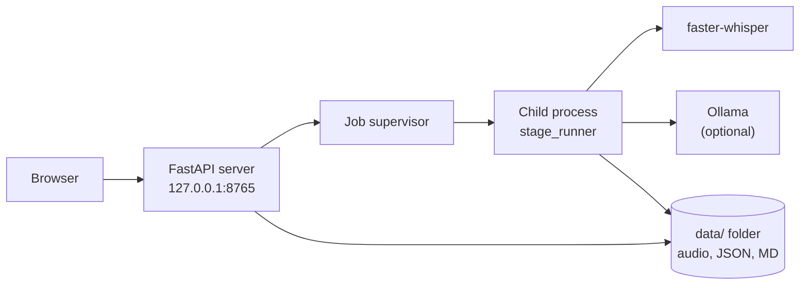

**English** | [Italiano](./README.it.md)

# Transcriber (sbobina)

A local transcription tool for recorded lectures in Italian: audio and text never leave your computer.


You record a lecture with your phone, drop the file into a page in your browser, and get the text back, split into paragraphs with timestamps. Words the model is unsure about are highlighted, so you know which passages to listen to again.

Under the hood it runs [faster-whisper](https://github.com/SYSTRAN/faster-whisper) (Whisper large-v3 on an NVIDIA GPU, large-v3-turbo on the CPU). An optional second pass sends the text to a local LLM through [Ollama](https://ollama.com) to fix misheard words; the LLM may only substitute short word spans, and every edit is listed in a corrections report. The web UI and the command line share the same pipeline.

**Not a technical user?** Read the [user guide](./docs/user-guide.md): it covers installation and everyday use on Windows, macOS and Linux, step by step.

## In practice

Starting the web UI on a Linux machine with an RTX 4060 (`./avvia.sh`, which runs `uv run sbobina web`):

```text
INFO Sistema linux: trascrivo con GPU NVIDIA (float16), modello large-v3. Motivo: GPU NVIDIA e librerie CUDA disponibili su linux.
INFO Modello large-v3 già scaricato.
INFO Ollama è pronto.
INFO Interfaccia su http://127.0.0.1:8765
```

The browser then opens on the upload page. Messages are in Italian because the intended users are Italian students.

Measured on this project's hardware (from `src/sbobina/model_catalog.py`):

| Step | Hardware | Time |
| --- | --- | --- |
| Transcription, 85-min lecture, large-v3 | NVIDIA RTX 4060 8 GB | about 6.5 min |
| Transcription, 90-min lecture, large-v3-turbo | Intel Core i7, 13th gen (CPU only) | about 30 min |
| LLM correction, 85-min lecture, qwen3.5:9b | NVIDIA RTX 4060 8 GB | about 18 min |

## Features

- Web UI on `127.0.0.1`: upload, job queue with live progress, history, model downloads
- Reader: click a word to play the audio from that point; uncertain words highlighted; list of passages to re-listen
- Manual correction in the reader: select a word or a phrase, type the fix, save
- Exports: Markdown, JSON, DOCX and plain text (the DOCX/TXT copy has no timestamps or review marks)
- Optional Ollama correction with substitution-only guards and a corrections report
- Word Error Rate (WER) comparison against a hand-made reference transcript
- Automatic device choice: CUDA when an NVIDIA GPU and its libraries are available, CPU otherwise

## Tech stack

| Area | Components |
| --- | --- |
| Speech recognition | faster-whisper 1.2 (CTranslate2), CUDA 12 libraries from pip wheels (`cuda` extra) |
| Text correction | Ollama client, local model `qwen3.5:9b` by default |
| Web | FastAPI, Uvicorn, Jinja2 templates, vanilla JavaScript, Server-Sent Events for progress |
| Exports and metrics | python-docx, jiwer |
| Configuration | pydantic-settings (`SBOBINA_*` environment variables or `.env`) |
| Tooling | uv, pytest, ruff, mypy (strict) |

## Architecture



Each job runs in a child process, so a crash or a cancel does not take the web server down. On restart, jobs left running are marked as interrupted. All state lives in plain files under `data/`.

## Prerequisites

- [uv](https://docs.astral.sh/uv/). The launch scripts offer to install it if missing; uv then installs Python 3.12 by itself.
- Optional: an NVIDIA GPU with a working driver (Linux or Windows). Without it, transcription runs on the CPU.
- Optional: [Ollama](https://ollama.com/download) for the correction pass.
- About 8 GB of free disk space for the environment and the models.

Development and testing happen on Linux. The Windows and macOS paths are implemented but have not yet been run on real machines; [docs/checklist-windows-macos.md](./docs/checklist-windows-macos.md) is the checklist for the first test.

## Installation

1. Clone the repository:

   ```bash
   git clone https://github.com/AndreaBonn/speech-to-text.git
   cd speech-to-text
   ```

2. Start it. On Linux and macOS:

   ```bash
   ./avvia.sh
   ```

   On Windows, double-click `avvia.bat`.

The script installs uv if needed (after asking), adds the `cuda` extra when `nvidia-smi` finds a GPU, prepares the environment and opens `http://127.0.0.1:8765`. The first transcription downloads the Whisper model (about 3 GB for large-v3, 1.6 GB for large-v3-turbo) unless you download it first from the **Modelli** page.

Manual setup, without the scripts:

```bash
uv sync                  # CPU only
uv sync --extra cuda     # with an NVIDIA GPU
uv run sbobina web
```

`./avvia.sh` accepts `--port N` and `--no-browser`, passed through to `sbobina web`.

## Configuration

Every setting has a default. To change one, copy `.env.example` to `.env` and edit it, or set the environment variable. Main variables (full list in `src/sbobina/settings.py`):

| Name | Required | Description |
| --- | --- | --- |
| `SBOBINA_WHISPER_MODEL` | ⚠️ | Whisper model; `auto` (default) picks the GPU or CPU model below |
| `SBOBINA_WHISPER_MODEL_GPU` | ⚠️ | Model used on CUDA, default `large-v3` |
| `SBOBINA_WHISPER_MODEL_CPU` | ⚠️ | Model used on CPU, default `large-v3-turbo` |
| `SBOBINA_DEVICE` | ⚠️ | `auto`, `cuda` or `cpu` |
| `SBOBINA_COMPUTE_TYPE` | ⚠️ | CTranslate2 quantization, `auto` by default |
| `SBOBINA_CPU_THREADS` | ⚠️ | CPU threads, `0` = one per physical core |
| `SBOBINA_LANGUAGE` | ⚠️ | Audio language, default `it` |
| `SBOBINA_BEAM_SIZE` | ⚠️ | Beam search width, default `5` |
| `SBOBINA_VAD_FILTER` | ⚠️ | Silero VAD, `false` by default (it dropped words on long phone recordings) |
| `SBOBINA_CONDITION_ON_PREVIOUS_TEXT` | ⚠️ | `false` by default, to avoid repetition loops on hour-long audio |
| `SBOBINA_UNCERTAIN_THRESHOLD` | ⚠️ | Words below this confidence are flagged, default `0.7` |
| `SBOBINA_OLLAMA_MODEL` | ⚠️ | Correction model, default `qwen3.5:9b` |
| `SBOBINA_OLLAMA_HOST` | ⚠️ | Default `http://localhost:11434` |
| `SBOBINA_WEB_PORT` | ⚠️ | Default `8765` |
| `SBOBINA_DATA_DIR` | ⚠️ | Where jobs are stored, default `data` |
| `SBOBINA_WEB_MAX_UPLOAD_MB` | ⚠️ | Upload limit, default `1024` |

`SBOBINA_WEB_HOST` accepts only `127.0.0.1`, `::1` or `localhost`: the server cannot be exposed on the network.

## Command line

The same pipeline runs without the web UI:

| Command | What it does |
| --- | --- |
| `uv run sbobina trascrivi lezione.m4a -o sbobine/` | Transcribe; writes `lezione.json` and `lezione.md` |
| `uv run sbobina rendi sbobine/lezione.json --soglia 0.8` | Rebuild the `.md` with another uncertainty threshold, without transcribing again |
| `uv run sbobina correggi sbobine/lezione.json --materia "diritto privato"` | Ollama correction; writes the corrected files and a report |
| `uv run sbobina wer riferimento.txt sbobine/lezione.json` | Word Error Rate against a reference transcript |
| `uv run sbobina web [--port N] [--no-browser]` | Start the web UI |

In the reference text for `wer`, write numbers as digits ("10 minuti"), as the model does, or they count as errors.

## Repository structure

```text
speech-to-text/
├── src/sbobina/          # package: pipeline, CLI, correction, exports
│   ├── prompts/          # versioned LLM prompts
│   └── web/              # FastAPI app, job supervisor, templates, static files
├── tests/                # pytest suite, mirrors src/ (web/ for the UI)
├── docs/                 # user guides, cross-platform checklist, activity report
├── specs/                # design and plan of the web UI
├── avvia.sh / avvia.bat  # one-step launchers
└── .env.example          # optional settings
```

## Testing

```bash
uv run pytest            # 478 tests
uv run ruff check .
uv run mypy src tests
```

The tests replace faster-whisper and Ollama with fakes, so they run in a few seconds without transcribing real audio.

## Security

The server listens only on the loopback interface and checks the `Host` and `Origin` headers. To report a vulnerability, see [SECURITY.md](./SECURITY.md).

## License

Released under the Apache License 2.0. See [LICENSE](./LICENSE).

## Support the project

If this project was useful to you, consider giving it a star on [GitHub](https://github.com/AndreaBonn/speech-to-text): it helps other students find it.

Transcriber is free to use. If it helps you and you want to give something back, you can leave a tip via PayPal. The amount is up to you and it is entirely optional.

<p align="center">
  <a href="https://paypal.me/AndreaBonacci19"></a>
</p>
