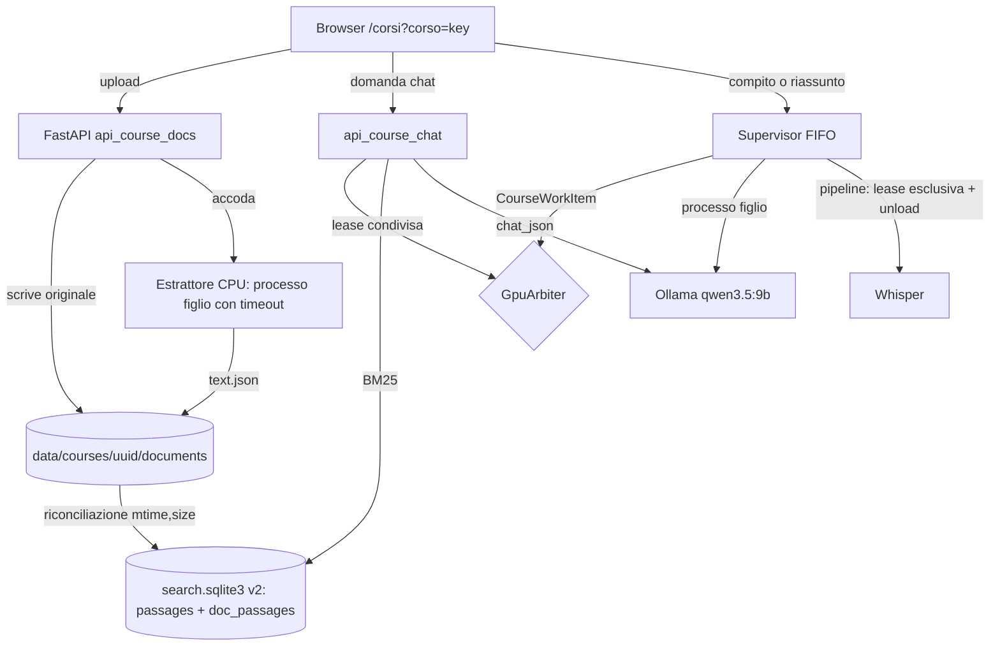

# ADR-001: Spazio di lavoro del corso (materiali, compiti, riassunti, chat)

**Stato**: Accettato il 2026-10-02 dopo le verifiche T001 (in fondo), con una revisione a D4
**Data**: 2026-10-02
**Ambito**: decisioni D1-D5 per la feature "materiale del corso" nella pagina `/corsi?corso=<key>`
**Relazione con decisioni precedenti**: estende `specs/study-library/plan.md` Q1-D (corso da
`meta.json`), Q2-B (indice SQLite derivato), Q3-B (coda FIFO tipizzata), Q6-A (map senza reduce),
Q7-A (validazione di esistenza della citazione). Nessuna di queste viene ribaltata; Q1-D viene
completata con un registro dei corsi che ha proprietario e scopo diversi (vedi D1).

## Contesto

L'utente vuole caricare, nella pagina di un corso, libro di testo, slide e appunti (PDF, DOCX,
PPTX, TXT/MD) accanto alle lezioni trascritte, e su questo materiale:

1. generare compiti d'esame (crocette, domande aperte, domande da orale) con le soluzioni in un
   documento separato;
2. generare il riassunto di un argomento indicato;
3. interrogare un chatbot che risponde solo sul materiale del corso.

Vincoli che delimitano lo spazio delle soluzioni:

| Vincolo | Fonte | Conseguenza |
|---|---|---|
| Nulla lascia la macchina | CLAUDE.md del progetto | niente API cloud, niente telemetria; scaricare un modello in ingresso è ammesso (già fatto per Whisper) |
| Un solo modello generativo: `qwen3.5:9b` via Ollama, `num_ctx 8192`, `think=False`, `temperature 0` | `ollama_chat.py` | il contesto utile per il materiale è circa 4.000-6.000 token: il retrieval è obbligatorio, non un'ottimizzazione |
| GPU RTX 4060 con 8188 MiB, condivisa con Whisper large-v3 float16 | `nvidia-smi` (misurato) | invariante R4: Whisper e Ollama mai insieme in VRAM. Oggi è garantito da `unload_ollama_models` prima di ogni stadio `transcribe` (`web/app.py:88`) e dal fatto che **solo** i processi figli della coda chiamano Ollama |
| Coda FIFO a un consumatore, voci `WorkItem(job_id, action ∈ {pipeline, study})` | `web/job_models.py:30`, `web/supervisor.py` | ogni lavoro GPU passa di lì; il server web non ha mai chiamato Ollama per generare |
| Colleghi su CPU, multi-OS (Linux, Windows, macOS) | memoria di progetto, `avvia.bat` | le dipendenze nuove devono avere wheel per i tre OS; qwen 9B su CPU è lento |
| Licenza Apache-2.0 | `pyproject.toml` | niente AGPL/GPL (PyMuPDF, poppler, marker esclusi) |
| File come fonte di verità, SQLite solo derivato | Q2-B | ogni indice nuovo è ricostruibile dai file |
| File Python ≤ 300 righe, funzioni ≤ 30 | `code-standards.md` | `supervisor.py` (232) e `search_index.py` (287) non possono crescere molto: le estensioni vanno in moduli nuovi |

Fatti già presenti nel codice e riusabili:

- `courses.py`: la chiave del corso è `NFKC + spazi compressi + casefold` dell'etichetta presa da
  `meta.json` o, in mancanza, da `config.subject`. Chiave vuota = "Senza corso". **Non esiste
  un'operazione di rinomina del corso**: l'etichetta si cambia lezione per lezione con
  `PATCH /api/v1/jobs/{id}/meta`.
- `search_index.py`: FTS5 `unicode61 remove_diacritics 2`, `prefix='3'`, un segmento Whisper per
  riga, `PRAGMA user_version` (oggi `SCHEMA_VERSION = 1`), ricostruzione su schema diverso o file
  corrotto.
- `study_citations.py`: citazione = 3-40 parole, match esatto su token normalizzati, contiguo,
  nel passaggio citato con tolleranza di un passaggio adiacente.
- Dipendenze transitive già nel lock: `numpy`, `onnxruntime`, `tokenizers`, `lxml` (`uv.lock`).
- Modelli Ollama installati: `qwen3.5:9b` (6.6 GB), `gemma3:4b` (3.3 GB), `qwen2.5vl:7b`
  (6.0 GB). Nessun modello di embedding.

## Panoramica della soluzione raccomandata



---

## D1. Identità e storage del corso per i documenti

### Passata 1: approcci generati

1. Cartella indicizzata dalla chiave: `data/courses/<sha256(key)>/`.
2. Registro con id stabile: `data/courses/<uuid>/course.json` con `{id, key, label}`; le lezioni
   restano legate per etichetta come oggi.
3. Corso come entità piena: le lezioni passano da etichetta a `course_id` in `meta.json`, con
   migrazione.
4. Documenti attaccati alle lezioni (`data/jobs/<id>/docs/`), corso ricavato come oggi.
5. Documenti in una libreria globale con tag di corso multipli (un libro può servire due corsi).
6. Corso come cartella sul filesystem scelta dall'utente (workspace esterno, sbobina la legge).

### Passata 2: valutazione

**Opzione 1, cartella per hash della chiave**

- Pro: nessun file di mappatura, lookup diretto, zero stato in più.
- Contro: la chiave è derivata dall'etichetta, quindi rinominare un corso (o correggere un
  refuso "Analisi l" → "Analisi I") **orfana** i documenti: la nuova chiave punta a una cartella
  vuota. Lo stesso succede se cambia la normalizzazione in `courses.py`. Non esprime "corso senza
  lezioni".
- Migrazione: nessuna. Scelta giusta solo se le etichette fossero immutabili, e non lo sono.

**Opzione 2, registro con id stabile (raccomandata)**

- Pro: i documenti hanno un proprietario stabile (`uuid`) che sopravvive alla rinomina; la chiave
  è un attributo aggiornabile del registro, non l'identità. Le lezioni non vanno migrate: Q1-D resta
  valido (`meta.json` è dell'utente, `job.json` del supervisor), il registro è un terzo file con un
  terzo proprietario (le API del corso). Un corso con documenti e zero lezioni esiste perché esiste
  `course.json`.
- Contro: due fonti per la stessa chiave (etichette nelle lezioni, `key` nel registro) che possono
  divergere; serve una rinomina esplicita che le aggiorni insieme, e non è transazionale fra file.
- Migrazione: nessuna sui dati esistenti; `course.json` nasce al primo upload in un corso.
- Giusta quando: le lezioni restano molte e le rinomine rare, che è il caso d'uso.

**Opzione 3, corso come entità piena**

- Pro: una sola fonte di verità, nessuna divergenza possibile. È il passaggio "C" già previsto da
  Q1 quando arriva il glossario per corso (roadmap fase 2).
- Contro: migrazione di tutti i `meta.json` e del fallback `config.subject`, riscrittura di
  `group_courses`, del campo corso nel lettore e del filtro di ricerca. Costo stimato 2-3 giorni
  senza beneficio visibile per questa feature.
- Giusta quando: arriva il glossario per corso, o la divergenza dell'opzione 2 si manifesta in
  pratica. L'opzione 2 è il primo passo dell'opzione 3 (l'`uuid` c'è già), non un vicolo cieco.

**Scartate**

- 4, documenti sulle lezioni: un libro non appartiene a una lezione; caricarlo 20 volte o sceglierne
  una arbitraria è peggio del problema.
- 5, libreria globale con tag: risolve un caso (stesso libro in due corsi) che nessuno ha chiesto,
  al prezzo di una UI di tagging. Il dedupe per `sha256` dentro il corso basta; due corsi = due copie.
- 6, cartella esterna: sbobina perde il controllo di scritture, permessi e percorsi multi-OS, e il
  "nulla lascia la macchina" diventa dipendente da dove l'utente mette la cartella (cloud sync).

### Decisione D1

Opzione 2. Dettagli:

- `data/courses/<uuid>/course.json`: `{id, key, label, created_at, updated_at}`, scritto in modo
  atomico (tmp + rename) solo da `course_registry.py`. Lookup per chiave = scansione di
  `data/courses/*/course.json` (decine di file, nessun indice).
- Elenco corsi = unione di `group_courses(lezioni)` e corsi registrati; un registrato senza lezioni
  compare con `lecture_count = 0`. La chiave vuota (Senza corso) **non** accetta documenti: 409
  `COURSE_REQUIRED`.
- Rinomina: nuovo `POST /api/v1/courses/{key}/rename {label}` che (1) aggiorna `course.json`,
  (2) riscrive `meta.json` di ogni lezione della vecchia chiave. Ordine scelto perché un crash dopo
  (1) lascia i documenti sulla chiave nuova e lezioni da spostare (stato visibile e ripetibile),
  mentre l'ordine inverso lascerebbe i documenti orfani. Chiave di destinazione già registrata con
  documenti: 409 `COURSE_EXISTS` (la fusione è fuori da v1).
- Rinomina implicita (l'utente cambia a mano il corso di tutte le lezioni dal lettore): i documenti
  restano sulla chiave vecchia, che compare come corso con 0 lezioni e N documenti. Non si perde
  niente; la UI offre "rinomina" o "sposta materiale".

---

## D2. Retrieval nel contesto di 8192 token, chunking e citazioni dei documenti

### Budget di contesto (BASIS: inferred)

`num_ctx 8192` = prompt di sistema (~700) + storia della chat (~500, solo chat) + output
(`num_predict` 700 per la chat, 1.500 per un passo di compito) + materiale. Restano circa
**5.000-6.000 token di materiale**, cioè 3.300-4.000 parole italiane assumendo ~1,5 token per
parola sul tokenizer Qwen. Il rapporto va misurato leggendo `prompt_eval_count` dalle risposte,
come fatto per lo studio (T034); l'assemblatore usa una stima prudente `len(testo) / 3,2` e si
corregge sulla misura.

### Passata 1: approcci generati

1. BM25 su FTS5, estendendo l'indice esistente con i passaggi dei documenti.
2. Embedding densi via Ollama (modello multilingue piccolo), vettori in SQLite, coseno a forza bruta.
3. Ibrido BM25 + denso con fusione per rango (RRF).
4. Embedding densi via `onnxruntime` già nel lock, su CPU, senza passare da Ollama.
5. Selezione esplicita dell'ambito (capitoli, pagine, lezioni scelti dall'utente) senza ricerca.
6. Espansione all'indicizzazione: il 9B scrive parole chiave e domande per ogni chunk
   (doc2query), indicizzate in BM25.
7. Scansione completa map-reduce di tutto il materiale a ogni richiesta.
8. Riscrittura della domanda da parte del 9B in parole chiave prima del BM25.

### Passata 2: valutazione

**Opzione 1, BM25 su FTS5 (raccomandata come base)**

- Pro: infrastruttura esistente (tokenizer, riconciliazione, ricostruzione, gestione FTS5 assente),
  zero VRAM, zero dipendenze, latenza di millisecondi, deterministico e testabile. Funziona su CPU
  per i colleghi. Le domande d'esame e i termini tecnici (nomi propri, formule, "teorema di Rolle")
  sono il caso in cui il lessicale va meglio.
- Contro: nessuno stemming italiano in `unicode61` (`derivata` non trova `derivate`, BASIS:
  inferred dalla documentazione FTS5); le domande in linguaggio naturale portano stopword e
  parafrasi ("come si calcola l'area sotto una curva" non trova "integrale definito").
- Mitigazioni deterministiche: rimozione di stopword italiane, termini troncati a prefisso
  (`deriv*`, sfrutta `prefix='3'`), query in OR con BM25 che pesa i termini rari.
- Giusta quando: il materiale è tecnico e il lessico della domanda coincide con quello del corso.

**Opzione 2, embedding via Ollama**

- Candidati multilingue: `embeddinggemma` (~300M parametri), `bge-m3` (~570M), `qwen3-embedding:0.6b`.
  UNVERIFIED: nomi dei tag Ollama, dimensioni, qualità sull'italiano, da verificare con
  `ollama show` e su un set di prova prima di scegliere.
- Pro: trova parafrasi e domande concettuali; i vettori di un corso intero (un libro da 400 pagine
  ≈ 1.500 chunk, 30 lezioni ≈ 1.000 finestre) stanno in pochi MB e il coseno a forza bruta con
  `numpy` (già nel lock) costa millisecondi.
- Contro, il punto decisivo: il 9B con `num_ctx 8192` occupa quasi tutta la VRAM (6.6 GB di pesi
  più la cache KV, su 8188 MiB). Un secondo modello in GPU fa scattare l'eviction di Ollama a ogni
  domanda: scarica il 9B, carica l'embedding, lo scarica, ricarica il 9B (secondi per giro,
  UNVERIFIED). Con l'embedding forzato su CPU (`num_gpu: 0`, UNVERIFIED che Ollama lo onori per
  modelli di embedding) la query costa poco, ma l'indicizzazione di un libro diventa minuti di CPU.
  In più ogni modifica al testo invalida vettori: serve una seconda riconciliazione.
- Migrazione: nuova colonna/tabella vettori, nuovo stadio di indicizzazione, nuovo modello da
  scaricare. 2-3 giorni.
- Giusta quando: una misura mostra che BM25 manca le domande concettuali.

**Opzione 3, ibrido BM25 + denso con RRF**

- Pro: in letteratura è il default più robusto (unisce lessico e semantica).
- Contro: somma i costi di 1 e 2; senza un set di valutazione non si sa se il guadagno esiste su
  questo corpus.
- Giusta quando: come 2, ed è la forma in cui 2 va aggiunta (mai denso da solo, perderebbe i
  termini tecnici esatti).

**Opzione 4, embedding ONNX su CPU via `onnxruntime`**

- Pro: nessuna contesa di VRAM per costruzione, `onnxruntime` è già installato (dipendenza di
  faster-whisper), modelli piccoli multilingue (famiglia e5/MiniLM) girano su CPU.
- Contro: secondo runtime di inferenza da mantenere, download del modello da Hugging Face e
  tokenizer da allineare; qualità sull'italiano UNVERIFIED.
- Giusta quando: si arriva al denso e l'opzione 2 su CPU risulta scomoda; è l'alternativa concreta
  a "embedding in Ollama", da confrontare in quel momento.

**Opzione 5, selezione esplicita dell'ambito (raccomandata per compiti e riassunti)**

- Pro: per un compito d'esame l'utente sa già cosa chiede ("capitoli 3-4 e lezioni 5-7"): la
  selezione è più affidabile di qualsiasi ricerca, non ha falsi negativi e rende il risultato
  ripetibile. Nessun costo di infrastruttura.
- Contro: non serve alla chat e non scala oltre ciò che sta nel contesto senza map (vedi D3).
- Combinata con 1: ambito come filtro, BM25 dentro l'ambito per il riassunto di un argomento.

**Scartate**

- 6, doc2query con il 9B: un libro da 1.500 chunk a ~10 s l'uno sono circa 4 ore di GPU
  (BASIS: inferred) e le parole chiave generate sono a loro volta allucinabili.
- 7, scansione completa: un passo per ogni gruppo di chunk a ogni domanda della chat sono minuti
  per risposta. Resta valida solo dentro un ambito scelto (opzione 5).
- 8, riscrittura della domanda con il 9B: aggiunge una chiamata (secondi) a ogni domanda per
  ottenere ciò che stopword + prefissi fanno in modo deterministico. Da rivalutare dopo la misura,
  come le opzioni 2-4.

### Decisione D2

- **v1: opzione 1 + opzione 5.** Chat: BM25 sull'intero corso (lezioni del corso + documenti).
  Riassunto: BM25 sull'argomento, filtrato dall'ambito se indicato. Compito: ambito obbligatorio,
  nessuna ricerca.
- **Gate per il denso (opzioni 3 con 2 o 4)**: set di 30 domande reali su un corso vero con i
  passaggi attesi annotati a mano; si misura recall@8 del BM25. Sotto 0,7 si apre l'ADR del denso
  e si confrontano 2 e 4 sullo stesso set. È lo stesso criterio della roadmap ("tienilo solo se il
  WER scende"): niente infrastruttura senza misura (`performance.md`).
- Lo schema dei passaggi tiene un `passage_id` stabile per poter aggiungere i vettori senza
  ricostruire il resto.

### Chunking

| Sorgente | Unità di citazione | Unità di indicizzazione | Unità di contesto |
|---|---|---|---|
| Lezione | segmento Whisper (come oggi) | segmento (indice esistente, invariato) | finestra di ~250 parole attorno ai segmenti trovati, fusa se adiacente |
| PDF libro/appunti | pagina | pagina; oltre 400 parole, finestre di 300 parole con 50 di sovrapposizione | il chunk più quello adiacente se il budget lo consente |
| PPTX | slide (testo + note del relatore) | slide | slide più le due vicine (le slide sole sono povere di contesto) |
| PDF di slide esportate | pagina = slide | pagina | come PPTX |
| DOCX | paragrafo sotto il titolo più vicino (il DOCX non ha pagine) | sezione per titolo, a finestre come il PDF | come PDF |
| TXT/MD | blocco sotto il titolo Markdown o paragrafo | come DOCX | come DOCX |

Nell'indice: nuova tabella FTS5 `doc_passages(text, course_id UNINDEXED, doc_id UNINDEXED,
locator UNINDEXED, passage_id UNINDEXED)` con lo stesso tokenizer, tabella `documents` per la
riconciliazione su `(mtime_ns, size)` di `text.json`, `SCHEMA_VERSION = 2` (il database è derivato:
la ricostruzione al primo avvio è il comportamento previsto, non una migrazione). Il filtro per
corso delle lezioni si calcola alla query dall'insieme dei `job_id` del corso (stessa lettura di
`meta.json` che fa già `/courses`), così una modifica a `meta.json` non lascia l'indice indietro.

### Citazioni verificabili sui documenti

- Formato nel prompt: `[D3-p47]` per pagina, `[D2-s12]` per slide, `[D5-§4]` per sezione DOCX/MD,
  `[L<job>-S<seg>]` per le lezioni (come oggi).
- Persistite come `{source: {kind: "doc", doc_id, locator: {page: 47, page_label: "35"}} |
  {kind: "lecture", job_id, segment_index}, quote}`. La pagina fisica serve al link, l'etichetta
  stampata (`page_labels` del PDF, UNVERIFIED per la libreria scelta) è quella che lo studente
  ritrova sul libro.
- Validazione: stessa regola di `study_citations.py` (3-40 parole, match esatto contiguo su token
  normalizzati, tolleranza di un'unità adiacente: la pagina successiva per una frase spezzata a
  fine pagina). Va estratta una funzione pura `locate_quote_in_text(tokens, quote)` dal codice
  esistente, oggi legato a `Segment`: estrazione di logica pura, non astrazione speculativa.
- Il testo di riferimento è il testo estratto e salvato in `text.json`, non il PDF: la validazione
  è coerente per costruzione anche quando l'estrazione è imperfetta. Il limite va detto in UI:
  la citazione prova che la frase è nel testo estratto, e il link apre la pagina del PDF originale
  per il controllo a vista.

---

## D3. Arbitraggio GPU: chat interattiva e generazioni lunghe

### Il problema (BASIS: measured sul codice)

Oggi R4 regge perché Ollama viene chiamato solo dai processi figli della coda e perché il
supervisor scarica i modelli prima di ogni `transcribe`. Una chat servita dal processo web rompe
la seconda condizione: una domanda arrivata a metà trascrizione fa ricaricare il 9B in VRAM mentre
Whisper sta allocando, e l'esito probabile è un out-of-memory della trascrizione (BASIS: inferred,
6.6 GB + Whisper large-v3 float16 non stanno in 8188 MiB).

### Passata 1: approcci generati

1. Chat come voce della coda FIFO con priorità (in testa), un processo figlio per domanda.
2. Arbitro GPU nel processo web: lease esclusiva per Whisper, lease condivisa per gli usi Ollama
   (chat e figli `study`/corsi); chat rifiutata con 409 mentre Whisper lavora.
3. Chat su CPU quando la GPU è occupata (`num_gpu: 0`, oppure `gemma3:4b` su CPU).
4. Prelazione: la chat sospende la trascrizione in corso e la riprende dopo.
5. Processo worker dedicato e permanente per la chat, che possiede il client Ollama.
6. Finestra "sessione di studio": aprendo la chat l'utente blocca l'avvio di nuove trascrizioni
   per N minuti di inattività.
7. Domande della chat accodate e risposte asincrone (notifica quando la GPU si libera).

### Passata 2: valutazione

**Opzione 1, chat in coda con priorità**

- Pro: R4 garantito dal meccanismo che esiste già; nessun nuovo stato condiviso.
- Contro: una domanda arrivata durante una trascrizione di 85 minuti aspetta la fine dello stadio
  (la priorità non interrompe un figlio già partito); ogni domanda paga avvio del processo e
  caricamento dei moduli. Una chat che risponde fra mezz'ora non è una chat.
- Giusta quando: l'uso della chat fosse raro e asincrono, e non è il caso.

**Opzione 2, arbitro GPU con lease (raccomandata)**

- Forma: `GpuArbiter` nel processo web, readers-writer lock con priorità allo scrittore.
  `acquire_exclusive()` lo chiama il supervisor prima di `transcribe` (attende la fine delle chat
  in volo, poi scarica Ollama come oggi); `try_acquire_shared()` lo chiama l'API della chat e
  fallisce subito se uno stadio esclusivo è attivo o in attesa.
- Pro: la chat risponde in secondi quando la GPU è libera o occupata da un altro uso Ollama (stesso
  modello, stesse opzioni: Ollama non ricarica); R4 diventa un invariante con un solo punto di
  enforcement invece di una convenzione ("solo i figli chiamano Ollama") che la chat violerebbe.
  Durante la trascrizione l'utente riceve 409 `GPU_BUSY` con l'ETA letta da `progress.json`, non un
  crash.
- Contro: stato condiviso nuovo con concorrenza vera (thread FastAPI e thread del supervisor),
  da testare con casi paralleli; l'attesa dello scrittore è limitata dal `num_predict` della chat
  (una risposta, ~30 s, BASIS: inferred) e va protetta con un timeout.
- Dettagli non negoziabili: la chat usa **le stesse opzioni** del modello nei figli (`num_ctx
  8192`): un `num_ctx` diverso fa ricaricare il modello (UNVERIFIED sul comportamento di Ollama
  0.18, da misurare con `ollama ps`). Chat contemporanea a un figlio `study`: Ollama serializza o
  parallelizza secondo `OLLAMA_NUM_PARALLEL`; la parallelizzazione alloca altra cache KV e può
  sforare la VRAM (UNVERIFIED), quindi il supervisor imposta il limite a 1 o la lease condivisa
  ammette un solo utilizzatore alla volta. Da misurare in T-verifica con `nvidia-smi`.

**Opzione 3, chat su CPU quando la GPU è occupata**

- Pro: la chat non si ferma mai.
- Contro: due qualità di risposta diverse a seconda del momento; un secondo caricamento del 9B in
  RAM (6.6 GB) accanto a Whisper; velocità su CPU di pochi token al secondo (UNVERIFIED). Con
  `gemma3:4b` la qualità cala e i prompt andrebbero tarati due volte.
- Giusta quando: i colleghi senza GPU, dove la CPU è l'unica via comunque. Lì la lease esclusiva
  non esiste e l'arbitro si riduce a un mutex sull'uso concorrente della CPU.

**Scartate**

- 4, prelazione: faster-whisper non ha un punto di ripresa a metà file; servirebbe checkpoint per
  segmento e ricostruzione dell'output. Costo alto per un beneficio che l'opzione 2 ottiene
  rimandando la domanda.
- 5, worker dedicato: Ollama è già un processo separato; il processo web fa solo I/O HTTP, quindi
  un worker in più aggiunge IPC senza risolvere l'arbitraggio, che resta da fare.
- 6, sessione di studio che blocca la coda: comportamento invisibile ("perché la mia trascrizione
  non parte?"); diventa interessante solo se il 409 si rivela fastidioso in pratica, e allora è
  un'estensione dell'opzione 2, non un'alternativa.
- 7, risposte asincrone: è l'opzione 1 con una notifica; stesso problema di latenza.

### Generazioni lunghe: compiti e riassunti

Passata 1: (a) nuova azione della coda esistente con bersaglio "corso"; (b) coda separata per il
corso; (c) chiamate sincrone dal processo web sotto lease condivisa.

- (a) **raccomandata**: stessa garanzia R4, stesso recupero al boot, stesso progress via file +
  SSE. Costo: `WorkItem` diventa un'unione discriminata `JobWorkItem(job_id, action)` |
  `CourseWorkItem(course_id, run_id, action ∈ {exam, summary})`; lo stato dei run di corso sta in
  `data/courses/<uuid>/runs/<run_id>.json` (scritto solo dal supervisor, stesso principio di
  `job.json`). `supervisor.py` è a 232 righe: lo smistamento per bersaglio va in un modulo nuovo
  (`course_work_items.py`) prima di estenderlo.
- (b) scartata: due consumatori GPU in parallelo, viola R4 (stessa ragione di Q3-C).
- (c) scartata: un compito su due capitoli sono ~7 chiamate da ~60 s (BASIS: inferred); un
  processo web che tiene la GPU 7 minuti blocca la coda senza poter essere annullato o ripreso.

Algoritmo dei compiti (coerente con Q6-A, niente reduce LLM):

1. Ambito → passaggi in ordine di sorgente → gruppi che riempiono il budget di contesto.
2. Per gruppo, una chiamata che produce N domande candidate del formato scelto, ciascuna con
   risposta/soluzione e citazione obbligatoria (per le crocette: citazione dell'opzione corretta;
   i distrattori non si citano, devono essere falsi, e la validazione non lo può provare).
3. Validazione delle citazioni; candidate senza citazione valida scartate con reason code.
4. Selezione deterministica delle domande finali (copertura uniforme dei gruppi, nessuna domanda
   duplicata per citazione), non un passo LLM.
5. Due artefatti dallo stesso JSON: testo del compito e soluzioni con citazioni.

Riassunto di un argomento: BM25 (dentro l'ambito, se indicato) → top passaggi → chiamate per gruppo
con punti citati → punti ordinati per posizione nella sorgente. Nessuna fusione LLM.

---

## D4. Estrazione del testo

### Passata 1: approcci generati

1. `pypdf` (puro Python) per i PDF.
2. `pdfplumber` (su `pdfminer.six` e `pypdfium2`).
3. `pypdfium2` (binding del motore PDFium).
4. Conversione esterna (LibreOffice headless, poppler `pdftotext`).
5. Pipeline di document understanding (docling, unstructured, marker).
6. OCR delle pagine scansionate con `qwen2.5vl:7b` via Ollama.
7. OCR con Tesseract.
8. PPTX con `python-pptx`; DOCX con `python-docx` (già dipendenza); TXT/MD letti diretti.

### Passata 2: valutazione

Tutte le affermazioni su licenze e comportamento delle librerie qui sotto sono UNVERIFIED (da
training data): vanno controllate su PyPI e nella documentazione prima di aggiungere la dipendenza.

**`pypdf`** (BSD-3, puro Python)

- Pro: nessun binario, wheel identica sui tre OS dei colleghi, supporta `page_labels` e una
  modalità di estrazione layout. Il rischio di installazione è il più basso.
- Contro: più lenta sui libri da centinaia di pagine; su alcuni PDF perde gli spazi fra parole o
  l'ordine delle colonne. Una frase senza spazi rompe sia il BM25 sia la validazione delle citazioni.

**`pypdfium2`** (Apache-2.0 / BSD-3, wheel binarie con PDFium)

- Pro: estrazione veloce e robusta su PDF malformati (è il motore di Chrome), testo generalmente
  più pulito.
- Contro: un binario nativo in più (il progetto ne ha già: `ctranslate2`, `av`), con il rischio
  di wheel mancante su qualche piattaforma.

**`pdfplumber`** (MIT, dipende da `pdfminer.six` e `pypdfium2`)

- Pro: coordinate di parole e tabelle, utile per layout complessi.
- Contro: porta comunque `pypdfium2`, è la più lenta delle tre, e le tabelle non servono a v1.
- Scartata: costa più di `pypdfium2` senza un caso d'uso per ciò che aggiunge.

**Scartate**

- 4, LibreOffice/poppler: binari esterni non presenti su Windows di default; poppler è GPL.
- 5, docling/unstructured/marker: dipendenze pesanti (torch, modelli scaricati), alcune GPL;
  docling userebbe la GPU in competizione con Whisper fuori dalla coda.
- 7, Tesseract: binario esterno da installare a mano su ogni OS.
- 6, OCR con `qwen2.5vl:7b`: rimandato, non scartato. Un modello di visione trascrive allucinando,
  e il testo trascritto diventa poi il riferimento contro cui si validano le citazioni: la
  validazione perderebbe valore proprio su quelle pagine. In più è un uso GPU lungo (minuti per
  libro) da far passare dalla coda. Si apre un ADR dedicato se gli scansionati si rivelano comuni.

### Decisione D4

- **PDF**: un solo modulo di confine `pdf_text.py` (come `transcriber.py` lo è per Whisper) con
  `pypdf` come default, e una **prova sui file reali dell'utente** prima di fissare la scelta: un
  libro, un PDF di slide, un PDF di appunti. Criterio: percentuale di pagine con parole incollate
  o ordine sbagliato, controllata a mano su 20 pagine campione. Se `pypdf` sbaglia oltre il 5%
  delle pagine, si passa a `pypdfium2` cambiando solo quel modulo. BASIS della scelta di default:
  inferred.
- **PPTX**: `python-pptx` (MIT, stesso autore di `python-docx`, UNVERIFIED), testo delle forme in
  ordine di lettura + note del relatore.
- **DOCX**: `python-docx` già presente; titoli come confini di sezione.
- **TXT/MD**: lettura UTF-8 con fallback dichiarato a cp1252 (file di Windows), titoli `#` come
  confini.
- **Normalizzazione comune**: NFKC (scioglie le legature tipo "fi"), riunione delle parole spezzate
  da trattino a fine riga, rimozione di intestazioni e piè di pagina ripetuti su oltre metà delle
  pagine.
- **Scansionati**: pagina con meno di 20 caratteri estratti marcata `no_text`; documento con oltre
  metà delle pagine `no_text` marcato "probabilmente scansionato, testo non disponibile" in UI.
  Nessun OCR in v1.
- **Dove gira**: processo figlio dedicato (`python -m sbobina.course_ingest <doc_dir>`) lanciato da
  un esecutore a un posto nel processo web, **fuori dalla coda GPU** (è solo CPU: non tocca R4 e
  non deve aspettare dietro una trascrizione di un'ora). Il processo figlio isola il server da PDF
  che mandano in crash o in loop il parser: timeout di 300 s, limite di memoria con `setrlimit` su
  Linux/macOS (su Windows solo timeout, dichiarato). DOCX e PPTX sono ZIP: si controlla la somma
  delle dimensioni non compresse prima di aprirli (zip bomb).

---

## D5. Persistenza di compiti, riassunti e conversazioni

### Passata 1: approcci generati

1. File JSON per artefatto sotto la cartella del corso, conversazioni in JSONL append-only.
2. SQLite come fonte di verità per lo spazio di lavoro del corso.
3. Conversazioni effimere (solo nel browser), compiti e riassunti su file.
4. Artefatti salvati solo come Markdown/DOCX renderizzati, senza JSON strutturato.
5. Artefatti dentro le cartelle dei job sorgente (come `audio.studio.json`).

### Passata 2: valutazione

**Opzione 1, file JSON e JSONL (raccomandata)**

- Pro: coerente con "file = verità" (Q2) e con lo studio (`audio.studio.json`): backup per copia
  di cartella, ispezionabile, cancellazione del corso = cancellazione di una cartella. Il JSON
  strutturato permette di rivalidare le citazioni a ogni lettura e di rigenerare il rendering.
  JSONL per la chat: una riga per turno, append senza riscrivere il file.
- Contro: elenco delle conversazioni per scansione di cartella (decine di file: irrilevante);
  append concorrente sulla stessa conversazione da due schede del browser, da serializzare con un
  lock per conversazione nel processo web (unico scrittore).

**Opzione 2, SQLite come fonte di verità**

- Pro: query e append transazionali.
- Contro: contraddice Q2-B (il database è derivato e si butta se corrotto: qui buttarlo perderebbe
  dati dell'utente); due regimi di persistenza nello stesso progetto. Nessuna query di v1 lo
  richiede.

**Opzione 3, chat effimera**

- Pro: nessuna persistenza da gestire, privacy massima.
- Contro: lo studente perde le risposte che voleva rileggere prima dell'esame; ricaricare la pagina
  cancella il lavoro. Ripiego valido solo se l'utente lo preferisce.

**Scartate**

- 4, solo rendering: perde citazioni strutturate, impossibile rivalidarle quando un documento viene
  rimosso o una lezione corretta.
- 5, nelle cartelle dei job: compiti e riassunti attraversano più lezioni e documenti, non hanno un
  job proprietario.

### Decisione D5

```
data/courses/<uuid>/
  course.json
  documents/<doc_id>/
    original.<ext>            # file caricato, mai modificato
    document.json             # nome, sha256, tipo, pagine, stato estrazione, versione estrattore
    text.json                 # unità estratte: [{locator, text, no_text}]
  runs/<run_id>.json          # stato del run di corso, solo supervisor
  exams/<run_id>.json         # compito + soluzioni + citazioni + scarti
  summaries/<run_id>.json
  chats/<conversation_id>.jsonl
```

- Ogni artefatto generato registra `{model, prompt_version, generated_at, sources: [{doc_id, sha256}
  | {job_id, revision}], discarded: [{reason, count}]}`. Le citazioni si rivalidano in lettura: un
  documento rimosso o una lezione modificata rendono la citazione "fonte cambiata", visibile, non
  cancellata in silenzio.
- Dedupe dei documenti per `sha256` dentro il corso: 409 `DOCUMENT_EXISTS` con l'id esistente.
- Rimozione di un documento: cancellazione della cartella + riconciliazione dell'indice; gli
  artefatti che lo citavano restano e mostrano la fonte come rimossa.
- Export di compiti e riassunti in DOCX tramite `docx_export.py` (già il confine `python-docx`),
  due file separati per compito e soluzioni.
- Prompt nuovi versionati in `src/sbobina/prompts/` (`corso-chat-v1.md`, `corso-compito-v1.md`,
  `corso-riassunto-v1.md`) e passati da prompt-master prima del commit (memoria di progetto).

---

## Rischi

Formato: causa, rischio, effetto.

1. **Recall del BM25 sulle domande della chat.** Poiché `unicode61` non ha stemming italiano e le
   domande sono in linguaggio naturale, il retrieval può non trovare il passaggio giusto anche
   quando c'è; il chatbot risponderebbe "non lo trovo nel materiale" su domande legittime o, peggio,
   risponderebbe su passaggi vicini ma sbagliati. Effetto: chat percepita come inutile e +2-3 giorni
   per il denso. Mitigazione: set di 30 domande e gate recall@8 ≥ 0,7 prima di consegnare la chat
   (D2).
2. **Violazione di R4 da un percorso che salta l'arbitro.** Poiché la chat porta per la prima volta
   le chiamate Ollama nel processo web, qualunque chiamata che non passa da `GpuArbiter` (un
   endpoint futuro, un'opzione `num_ctx` diversa che forza il ricaricamento, la parallelizzazione di
   Ollama) può far ricaricare il 9B mentre Whisper lavora. Effetto: trascrizione fallita per
   out-of-memory, da rilanciare (fino a 85 minuti persi). Mitigazione: un solo modulo che crea il
   client Ollama nel processo web e richiede la lease; test concorrente; misura con `nvidia-smi`
   durante una trascrizione con chat aperta.
3. **Qualità dell'estrazione e allucinazioni nelle soluzioni.** Poiché il testo estratto è il
   riferimento delle citazioni e il 9B parafrasa, un PDF con parole incollate produce domande su
   testo rovinato, e una soluzione può citare un passaggio vero e sbagliare la risposta (Q7: la
   validazione prova l'esistenza della citazione, non la correttezza). Effetto: uno studente che si
   prepara su una soluzione sbagliata; +1-2 giorni di taratura di estrattore e prompt. Mitigazione:
   prova sui PDF reali (D4), soluzioni sempre con citazione visibile, misura a mano su 20 domande
   come in T034.

Rischi minori: tempi su CPU per i colleghi (stessa gestione di R9: stima dalla velocità misurata,
nessun numero inventato); prompt injection dentro un documento caricato (impatto limitato: nessun
tool, output vincolato da schema e citazioni; il testo dei documenti va nel messaggio utente,
delimitato, mai nel prompt di sistema); dimensione dell'upload (oggi 1024 MB, adeguata ai libri).

## Conseguenze

Più facile:
- aggiungere il retrieval denso (passaggi con id stabile, gate di misura già definito);
- passare al corso come entità piena (l'`uuid` esiste già);
- nuovi formati di documento (un estrattore per formato dietro lo stesso `text.json`).

Più difficile:
- la coda passa da un bersaglio (job) a due (job, corso): il recupero al boot e la cancellazione
  vanno estesi e testati per entrambi;
- il processo web diventa un utilizzatore della GPU: l'arbitro è stato condiviso con concorrenza
  reale e un punto in cui un errore costa una trascrizione;
- due fonti per la chiave del corso (etichette delle lezioni, `course.json`) da tenere allineate
  con la rinomina esplicita.

## Verifiche da fare prima di accettare

- `ollama ps` dopo una chiamata con `num_ctx` diverso: conferma o smentisce il ricaricamento.
- Comportamento di `OLLAMA_NUM_PARALLEL` con chat + figlio `study` contemporanei, VRAM letta con
  `nvidia-smi`.
- Licenze e wheel per Linux/Windows/macOS di `pypdf`, `pypdfium2`, `python-pptx` su PyPI.
- Prova di estrazione sui PDF reali dell'utente (D4).
- Rapporto token/parola italiano letto da `prompt_eval_count`.

## Esito delle verifiche (T001, 2026-10-02)

Misurate su questa macchina (Ollama 0.18.0, RTX 4060 8 GB, `qwen3.5:9b`), script in scratchpad.

| Verifica | Esito | Conseguenza |
|---|---|---|
| (a) `num_ctx` diverso ricarica il modello? | Sì: 8192 a freddo 6,8 s di load; passare a 4096 ricarica (3,7 s), tornare a 8192 ricarica (3,5 s). A caldo 0,15 s | Ogni chiamata di sbobina usa lo stesso `num_ctx` (`CONTEXT_WINDOW_TOKENS`); la chat non lo cambia |
| (b) Due richieste concorrenti | Servite in sequenza (0,75 s e 1,35 s), VRAM invariata (6348 MiB); `OLLAMA_NUM_PARALLEL` non impostato | Nessuna crescita di VRAM con più schede; la seconda chat aspetta la prima |
| (c) Licenze e wheel | `pypdf` 6.19.0 BSD-3-Clause, wheel puro; `python-pptx` 1.0.2 MIT (richiede `lxml`, `Pillow`, `XlsxWriter`); `pypdfium2` 5.13.0 BSD-3-Clause/Apache-2.0, wheel binari multipiattaforma | Tutte compatibili con Apache-2.0 |
| (d) Estrazione su PDF reali | Non eseguita: nessun PDF reale dell'utente disponibile | Spostata in T014 (3 file reali) |
| (e) Token per parola italiana | 1500 parole di trascrizione → 3432 token = **2,29 token/parola** | Budget materiale per chiamata ≈ (8192 - prompt ~800 - output ~2048) / 2,29 ≈ **2300 parole**: recupero di ~8 passaggi da ~250 parole, non di più |

Osservazioni non richieste:
- Il modello caricato occupa 8,9 GB con split 28% CPU / 72% GPU: non entra tutto negli 8 GB, quindi
  la generazione è più lenta di quanto la VRAM farebbe pensare. Le stime di latenza della chat vanno
  misurate (T046), non dedotte.
- Il servizio Ollama ascolta su `0.0.0.0:11434` (systemd `OLLAMA_HOST`): raggiungibile dalla rete
  locale. sbobina lo chiama su localhost, ma chiunque sulla LAN può usare il modello. Fuori dallo
  scope del progetto, segnalato all'utente.

### Revisione a D4

`pypdfium2` serve comunque in F5 (OCR, U1) per renderizzare le pagine in immagine, cosa che `pypdf`
non fa. Una sola libreria PDF invece di due: **`pypdfium2` per estrazione del testo e render**,
dietro `pdf_text.py`. `pypdf` resta solo come dipendenza di test se serve generare PDF fixture (in
alternativa le fixture si generano con `pypdfium2` o con un PDF minimo scritto a mano nel test).
